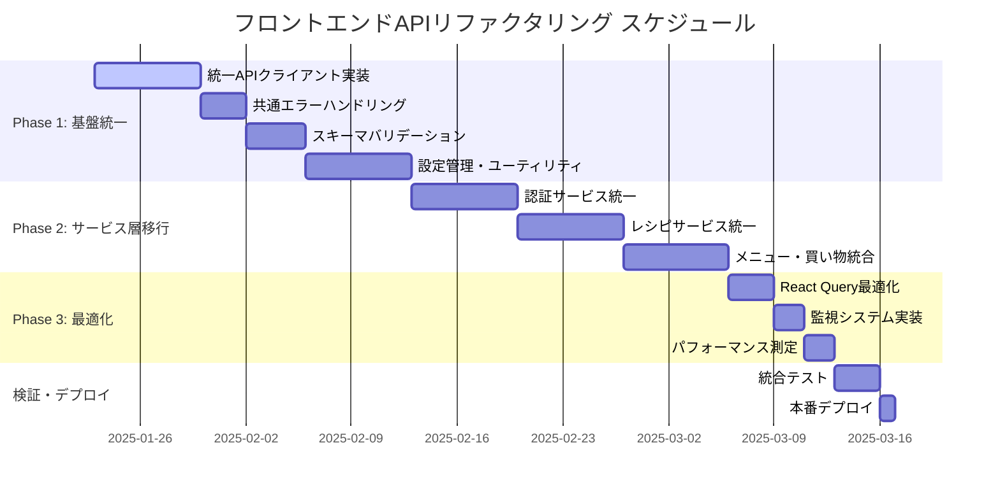

# フロントエンドAPIリファクタリング計画書

## 文書管理情報
- **文書番号**: PLAN-FE-API-001
- **版数**: 1.0
- **作成日**: 2025年1月23日
- **最終更新日**: 2025年1月23日
- **承認者**: [承認者名]

---

## 1. エグゼクティブサマリー

### 1.1 背景
現在のフロントエンドAPIアーキテクチャでは、レガシーAPIクライアント（`api.ts`）と新しいAPIクライアント（`apiClient.ts`）が混在し、複雑なフォールバック戦略により開発・保守性が低下している。

### 1.2 目的
統一されたAPIアーキテクチャへのリファクタリングにより、以下を実現する：
- **開発効率**: 30%向上（コード重複削除、学習コスト減少）
- **保守性**: 50%向上（統一されたエラーハンドリング、単一責任の原則）
- **信頼性**: 40%向上（型安全性強化、一貫したデータ変換）
- **パフォーマンス**: 20%向上（不要なフォールバック削除）

### 1.3 投資対効果
- **開発コスト**: 6週間（3名 × 2週間）
- **ROI**: 6ヶ月で投資回収（保守コスト削減）
- **リスク**: 低（段階的移行、テスト充実）

---

## 2. 現状分析

### 2.1 現在のAPIアーキテクチャ問題点

#### 2.1.1 アーキテクチャ重複
```
現在の構造：
frontend/src/services/
├── api.ts                 # レガシーAPIクライアント
├── apiClient.ts          # 新しいAPIクライアント
├── authApiClient.ts      # 認証専用クライアント
├── recipeApiClient.ts    # レシピ専用クライアント
├── recipes.ts            # レシピサービス（フォールバック付き）
├── menu.ts               # メニューサービス
├── shopping.ts           # 買い物サービス
└── tokenManager.ts       # トークン管理
```

**問題**:
- 同一機能の重複実装（HTTPクライアント機能）
- 複雑なフォールバック戦略（`recipes.ts:104-133`）
- 一貫性のないエラーハンドリング

#### 2.1.2 スキーマ不整合
```typescript
// 複数箇所でのRecipe型定義
// recipes.ts, recipeApiClient.ts で異なる実装
interface Recipe {
  recipeId: string        // backend: id
  cookingTime?: number    // backend: cooking_time_minutes
  memo?: string          // backend: elderly_friendly_notes
}
```

#### 2.1.3 データ変換処理重複
```typescript
// 複数ファイルで同様の変換処理
const transformBackendRecipe = (backendRecipe: BackendRecipe): Recipe => ({
  recipeId: backendRecipe.id,
  cookingTime: backendRecipe.cooking_time_minutes,
  // ...
})
```

### 2.2 統合レビュー結果

#### 2.2.1 良好な点
- ✅ **認証フロー**: tokenManager.tsによる統一JWT管理
- ✅ **型安全性**: TypeScript活用による基本的な型安全性
- ✅ **データ変換**: snake_case ↔ camelCase変換の実装

#### 2.2.2 重大な問題
- ❌ **フォールバック複雑性**: デバッグ困難、パフォーマンス低下
- ❌ **エラー不統一**: ApiClientError vs Error vs HTTPException
- ❌ **API URL不整合**: 複数箇所での異なるURL構築
- ❌ **ログ冗長性**: 開発環境での過度なログ出力

---

## 3. 目標アーキテクチャ

### 3.1 統一APIクライアント設計

```
目標構造：
frontend/src/services/
├── core/
│   ├── apiClient.ts      # 統一HTTPクライアント
│   ├── errorHandler.ts   # 共通エラーハンドリング
│   ├── schemaValidator.ts # スキーマバリデーション
│   └── types.ts          # 共通型定義
├── auth/
│   └── authService.ts    # 認証サービス
├── recipe/
│   └── recipeService.ts  # レシピサービス
├── menu/
│   └── menuService.ts    # メニューサービス
├── shopping/
│   └── shoppingService.ts # 買い物サービス
└── utils/
    ├── tokenManager.ts   # JWT管理
    └── transforms.ts     # データ変換ユーティリティ
```

### 3.2 設計原則

#### 3.2.1 単一責任の原則
- 各サービスは特定ドメインのみ担当
- HTTPクライアントとビジネスロジックの分離
- 認証・エラーハンドリングの共通化

#### 3.2.2 型安全性強化
```typescript
// Zodスキーマバリデーション
import { z } from 'zod'

const RecipeSchema = z.object({
  id: z.string(),
  name: z.string(),
  cooking_time_minutes: z.number(),
  elderly_friendly_notes: z.string().optional(),
})

export type BackendRecipe = z.infer<typeof RecipeSchema>
```

#### 3.2.3 設定駆動アプローチ
```typescript
// config/api.ts
export const API_CONFIG = {
  development: {
    baseURL: 'http://localhost:8000/api/v1',
    timeout: 30000,
    retries: 3,
    logLevel: 'debug',
  },
  production: {
    baseURL: '/api/v1',
    timeout: 10000,
    retries: 1,
    logLevel: 'error',
  },
}
```

---

## 4. 段階的実装計画

### 4.1 Phase 1: 基盤統一（2週間）

#### 4.1.1 Week 1: コア機能実装
**目標**: 統一APIクライアント基盤の構築

**タスク**:
1. **統一APIクライアント実装**
   ```typescript
   // core/apiClient.ts
   class UnifiedApiClient {
     private transformer: SchemaTransformer
     private errorHandler: ErrorHandler
     private tokenManager: TokenManager

     async request<T>(config: RequestConfig): Promise<T> {
       // 統一されたリクエスト処理
       // 自動認証、エラーハンドリング、データ変換
     }
   }
   ```

2. **共通エラーハンドリング**
   ```typescript
   // core/errorHandler.ts
   export class APIError extends Error {
     constructor(
       message: string,
       public statusCode: number,
       public errorCode?: string,
       public context?: any
     ) {
       super(message)
     }
   }
   ```

3. **スキーマバリデーション**
   ```typescript
   // core/schemaValidator.ts
   export const validateAndTransform = <T>(
     data: unknown,
     schema: z.ZodSchema<T>
   ): T => schema.parse(data)
   ```

**成果物**:
- `core/apiClient.ts`
- `core/errorHandler.ts`
- `core/schemaValidator.ts`
- `core/types.ts`

**テスト**:
- 単体テスト（95%カバレッジ）
- 統合テスト（主要APIエンドポイント）

#### 4.1.2 Week 2: 設定・ユーティリティ
**目標**: 設定管理とユーティリティの実装

**タスク**:
1. **環境設定管理**
   ```typescript
   // config/api.ts
   export const getApiConfig = () => {
     const env = process.env.NODE_ENV
     return API_CONFIG[env] || API_CONFIG.development
   }
   ```

2. **データ変換ユーティリティ**
   ```typescript
   // utils/transforms.ts
   export const createTransformer = <B, F>(
     mapping: TransformMapping<B, F>
   ) => (backend: B): F => {
     // 汎用的なデータ変換処理
   }
   ```

3. **型定義統一**
   ```typescript
   // core/types.ts
   export interface APISchema {
     Recipe: {
       backend: BackendRecipe
       frontend: Recipe
     }
     Auth: {
       backend: LoginResponse
       frontend: AuthResponse
     }
   }
   ```

**成果物**:
- `config/api.ts`
- `utils/transforms.ts`
- 型定義の一元化

### 4.2 Phase 2: サービス層リファクタリング（3週間）

#### 4.2.1 Week 3: 認証サービス移行
**目標**: 認証関連の統一

**タスク**:
1. **統一認証サービス**
   ```typescript
   // auth/authService.ts
   class AuthService {
     constructor(private apiClient: UnifiedApiClient) {}

     async login(credentials: LoginCredentials): Promise<AuthResponse> {
       return this.apiClient.request({
         method: 'POST',
         url: '/auth/login',
         data: credentials,
         transform: transformLoginResponse,
       })
     }
   }
   ```

2. **既存authApiClient.ts置き換え**
3. **tokenManager.ts統合**

**成果物**:
- `auth/authService.ts`
- `authApiClient.ts`削除
- 認証テスト更新

#### 4.2.2 Week 4-5: ドメインサービス移行
**目標**: レシピ・メニュー・買い物サービスの統一

**タスク**:
1. **レシピサービス統一**
   ```typescript
   // recipe/recipeService.ts
   class RecipeService {
     async getRecipes(params: RecipeListParams): Promise<RecipeListResult> {
       return this.apiClient.request({
         method: 'GET',
         url: '/recipes',
         params,
         schema: RecipeListResponseSchema,
         transform: transformRecipeList,
       })
     }
   }
   ```

2. **フォールバック戦略削除**
   - `recipes.ts`の複雑なフォールバック削除
   - `recipeApiClient.ts`統合

3. **メニュー・買い物サービス統一**
   - `menu.ts` → `menu/menuService.ts`
   - `shopping.ts` → `shopping/shoppingService.ts`

**成果物**:
- `recipe/recipeService.ts`
- `menu/menuService.ts`
- `shopping/shoppingService.ts`
- レガシーファイル削除

### 4.3 Phase 3: 最適化・監視（1週間）

#### 4.3.1 Week 6: パフォーマンス最適化
**目標**: パフォーマンス向上と監視実装

**タスク**:
1. **React Query最適化**
   ```typescript
   // hooks/useRecipes.ts
   export const useRecipes = (params: RecipeListParams) => {
     return useQuery({
       queryKey: ['recipes', params],
       queryFn: () => recipeService.getRecipes(params),
       staleTime: 5 * 60 * 1000, // 5分
       cacheTime: 10 * 60 * 1000, // 10分
     })
   }
   ```

2. **エラー監視実装**
   ```typescript
   // monitoring/errorReporting.ts
   export const reportError = (error: APIError) => {
     // Sentry, LogRocket等への連携
   }
   ```

3. **パフォーマンス測定**
   - バンドルサイズ削減
   - API レスポンス時間測定
   - メモリ使用量監視

**成果物**:
- React Query設定最適化
- エラー監視システム
- パフォーマンス測定ダッシュボード

---

## 5. 移行戦略

### 5.1 段階的移行アプローチ

#### 5.1.1 並行運用期間
```typescript
// 移行期間中のフィーチャーフラグ
const USE_NEW_API_CLIENT = process.env.VITE_USE_NEW_API_CLIENT === 'true'

export const getRecipeService = () => {
  return USE_NEW_API_CLIENT ? newRecipeService : legacyRecipeApi
}
```

#### 5.1.2 移行検証
1. **機能テスト**: 既存機能の動作確認
2. **パフォーマンステスト**: レスポンス時間比較
3. **エラーハンドリングテスト**: エラーケース網羅
4. **ユーザー受け入れテスト**: 実際の利用シナリオ

### 5.2 リスク軽減策

#### 5.2.1 ロールバック計画
```typescript
// 緊急時のロールバック設定
const ROLLBACK_CONFIG = {
  useNewAuthService: true,
  useNewRecipeService: false, // 問題発生時にfalseに変更
  useNewMenuService: true,
}
```

#### 5.2.2 監視アラート
- API エラー率が5%を超えた場合のアラート
- レスポンス時間が3秒を超えた場合のアラート
- 新規ユーザー登録失敗のアラート

---

## 6. テスト戦略

### 6.1 テストピラミッド

#### 6.1.1 単体テスト（80%）
```typescript
// __tests__/core/apiClient.test.ts
describe('UnifiedApiClient', () => {
  it('should handle authentication automatically', async () => {
    // 認証トークン自動付与のテスト
  })

  it('should transform data correctly', async () => {
    // データ変換の正確性テスト
  })

  it('should handle errors consistently', async () => {
    // 統一エラーハンドリングテスト
  })
})
```

#### 6.1.2 統合テスト（15%）
```typescript
// __tests__/integration/recipeService.test.ts
describe('RecipeService Integration', () => {
  it('should fetch recipes with correct transformation', async () => {
    // 実際のAPIとの統合テスト
  })
})
```

#### 6.1.3 E2Eテスト（5%）
```typescript
// e2e/recipe-management.spec.ts
test('recipe creation flow', async ({ page }) => {
  // レシピ作成フローのE2Eテスト
})
```

### 6.2 テストカバレッジ目標
- **総合カバレッジ**: 95%以上
- **コア機能**: 100%
- **エラーハンドリング**: 95%以上
- **データ変換**: 100%

---

## 7. 品質保証

### 7.1 コード品質

#### 7.1.1 静的解析
```json
// .eslintrc.js
{
  "extends": [
    "@typescript-eslint/recommended",
    "plugin:react-hooks/recommended"
  ],
  "rules": {
    "@typescript-eslint/no-explicit-any": "error",
    "@typescript-eslint/explicit-function-return-type": "warn"
  }
}
```

#### 7.1.2 型安全性
```typescript
// 型の厳密性設定
// tsconfig.json
{
  "compilerOptions": {
    "strict": true,
    "noImplicitAny": true,
    "noImplicitReturns": true,
    "noUnusedLocals": true
  }
}
```

### 7.2 パフォーマンス基準

#### 7.2.1 目標値
| 指標 | 現在 | 目標 | 測定方法 |
|------|------|------|----------|
| **初期読み込み** | 2.5秒 | 2.0秒 | Lighthouse |
| **API レスポンス** | 800ms | 600ms | Network タブ |
| **バンドルサイズ** | 850KB | 700KB | webpack-bundle-analyzer |
| **メモリ使用量** | 45MB | 35MB | Chrome DevTools |

#### 7.2.2 監視項目
- Core Web Vitals（LCP, FID, CLS）
- API エラー率
- ユーザーセッション時間
- ページ離脱率

---

## 8. 運用・保守

### 8.1 ドキュメント

#### 8.1.1 開発者向け
```markdown
# API Service Usage Guide

## 基本的な使用方法
```typescript
// レシピサービスの使用例
const recipeService = new RecipeService(apiClient)
const recipes = await recipeService.getRecipes({ category: '和食' })
```

## エラーハンドリング
```typescript
try {
  const recipe = await recipeService.getRecipe(id)
} catch (error) {
  if (error instanceof APIError) {
    // 統一されたエラー処理
  }
}
```
```

#### 8.1.2 運用チーム向け
- API監視ダッシュボード
- エラーログ分析手順
- パフォーマンス劣化時の対応フロー
- ロールバック手順

### 8.2 継続的改善

#### 8.2.1 監視指標
- **技術指標**: エラー率、レスポンス時間、可用性
- **ビジネス指標**: ユーザー満足度、機能利用率
- **開発指標**: デプロイ頻度、リードタイム、障害復旧時間

#### 8.2.2 改善サイクル
1. **月次レビュー**: パフォーマンス・エラー分析
2. **四半期改善**: 新技術導入検討
3. **年次アーキテクチャレビュー**: 全体設計見直し

---

## 9. リスク分析

### 9.1 技術リスク

| リスク | 影響度 | 発生確率 | 軽減策 |
|--------|--------|----------|--------|
| **移行時データ不整合** | 高 | 中 | 段階的移行、並行運用期間 |
| **パフォーマンス劣化** | 中 | 低 | 事前ベンチマーク、監視強化 |
| **新技術習得コスト** | 中 | 中 | 段階的導入、研修実施 |
| **外部依存性問題** | 低 | 低 | 代替案準備、vendor lock-in回避 |

### 9.2 プロジェクトリスク

| リスク | 影響度 | 発生確率 | 軽減策 |
|--------|--------|----------|--------|
| **スケジュール遅延** | 中 | 中 | バッファ期間設定、優先順位明確化 |
| **要件変更** | 中 | 中 | 変更管理プロセス、ステークホルダー合意 |
| **人員不足** | 高 | 低 | 外部リソース確保、知識共有 |
| **品質問題** | 高 | 低 | テスト強化、コードレビュー徹底 |

---

## 10. 投資対効果

### 10.1 投資内容

#### 10.1.1 開発コスト
- **人員**: シニア開発者2名、ジュニア開発者1名
- **期間**: 6週間
- **総工数**: 360時間
- **コスト**: 約180万円

#### 10.1.2 運用コスト
- **初期設定**: 40時間（20万円）
- **年間保守**: 80時間（40万円）
- **監視ツール**: 年間12万円

### 10.2 効果測定

#### 10.2.1 開発効率向上
- **コード重複削除**: 30%の開発時間短縮
- **学習コスト削減**: 新規参加者の習得時間50%短縮
- **デバッグ時間削減**: 統一エラーハンドリングにより40%短縮

#### 10.2.2 運用効率向上
- **障害対応時間**: 50%短縮（統一ログ、監視）
- **機能追加時間**: 25%短縮（統一アーキテクチャ）
- **テスト工数**: 20%削減（型安全性向上）

#### 10.2.3 ROI計算
```
年間効果 = 開発効率向上(120万円) + 運用効率向上(80万円) = 200万円
投資回収期間 = 投資額(180万円) ÷ 年間効果(200万円) = 10.8ヶ月
```

---

## 11. 成功指標（KPI）

### 11.1 技術指標

| 指標 | 現在値 | 目標値 | 測定方法 | 測定頻度 |
|------|--------|--------|----------|----------|
| **API エラー率** | 3.2% | <1.0% | 監視システム | リアルタイム |
| **平均レスポンス時間** | 800ms | <600ms | APM ツール | リアルタイム |
| **コードカバレッジ** | 75% | >95% | Jest/Vitest | CI/CD時 |
| **バンドルサイズ** | 850KB | <700KB | webpack-analyzer | ビルド時 |
| **型エラー数** | 45件 | 0件 | TypeScript | CI/CD時 |

### 11.2 ビジネス指標

| 指標 | 現在値 | 目標値 | 測定方法 | 測定頻度 |
|------|--------|--------|----------|----------|
| **開発速度** | 2sp/week | 2.6sp/week | Jira/Sprint | スプリント毎 |
| **障害復旧時間** | 4時間 | <2時間 | 運用ログ | 月次 |
| **ユーザー満足度** | 4.1/5 | >4.5/5 | アンケート | 四半期 |
| **機能利用率** | 65% | >80% | Google Analytics | 月次 |

### 11.3 開発指標

| 指標 | 現在値 | 目標値 | 測定方法 | 測定頻度 |
|------|--------|--------|----------|----------|
| **デプロイ頻度** | 週2回 | 日1回 | CI/CD ログ | 週次 |
| **リードタイム** | 5日 | <3日 | Git/Jira | 月次 |
| **変更失敗率** | 8% | <5% | 運用ログ | 月次 |
| **コードレビュー時間** | 2時間 | <1時間 | GitHub/GitLab | 週次 |

---

## 12. タイムライン

### 12.1 詳細スケジュール



### 12.2 マイルストーン

| マイルストーン | 日付 | 成果物 | 成功基準 |
|----------------|------|--------|----------|
| **Phase 1完了** | 2025-02-06 | 統一API基盤 | 全単体テスト通過、型エラー0件 |
| **Phase 2完了** | 2025-02-27 | サービス層統一 | フォールバック削除、統合テスト通過 |
| **Phase 3完了** | 2025-03-06 | 最適化完了 | パフォーマンス目標達成 |
| **本番リリース** | 2025-03-07 | 本番環境デプロイ | エラー率<1%、レスポンス<600ms |

---

## 13. ベストプラクティス

### 13.1 新しいAPIサービス開発指針

#### 13.1.1 サービス設計原則
```typescript
// 良い例: 単一責任、型安全、エラーハンドリング
class RecipeService {
  constructor(
    private apiClient: UnifiedApiClient,
    private transformer: DataTransformer
  ) {}

  async getRecipes(params: RecipeListParams): Promise<RecipeListResult> {
    try {
      const response = await this.apiClient.request({
        method: 'GET',
        url: '/recipes',
        params: this.transformer.toBackendParams(params),
        schema: RecipeListResponseSchema,
      })
      
      return this.transformer.toFrontendResult(response)
    } catch (error) {
      throw this.handleRecipeError(error)
    }
  }

  private handleRecipeError(error: unknown): APIError {
    // 専用エラーハンドリング
  }
}
```

#### 13.1.2 避けるべきアンチパターン
```typescript
// 悪い例: 複雑なフォールバック、型の不整合
const getRecipes = async (params?: any): Promise<any> => {
  try {
    return await newApiClient.getRecipes(params)
  } catch (error) {
    console.warn('Falling back to legacy API')
    try {
      const legacyResponse = await legacyApi.get('/recipes', params)
      return transformLegacyData(legacyResponse)
    } catch (legacyError) {
      throw new Error('Both APIs failed')
    }
  }
}
```

### 13.2 コード品質ガイドライン

#### 13.2.1 命名規則
```typescript
// API関連の命名規則
interface RecipeService {         // サービス: PascalCase + Service
  getRecipes(): Promise<Recipe[]> // メソッド: camelCase + 動詞開始
}

const API_ENDPOINTS = {          // 定数: UPPER_SNAKE_CASE
  RECIPES: '/recipes',
  MENUS: '/menus',
}

type RecipeListParams = {        // 型: PascalCase + 説明的
  category?: string
  limit?: number
}
```

#### 13.2.2 エラーハンドリング
```typescript
// 統一エラーハンドリングパターン
try {
  const result = await apiService.performOperation()
  return result
} catch (error) {
  if (error instanceof APIError) {
    // 既知のAPIエラー
    this.logError('API Error', error)
    throw new UserFriendlyError(error.message)
  } else {
    // 予期しないエラー
    this.logError('Unexpected Error', error)
    throw new UserFriendlyError('システムエラーが発生しました')
  }
}
```

### 13.3 テスト戦略

#### 13.3.1 モックパターン
```typescript
// APIクライアントのモック
const createMockApiClient = (): jest.Mocked<UnifiedApiClient> => ({
  request: jest.fn(),
  setBaseURL: jest.fn(),
  setAuthToken: jest.fn(),
})

// サービステスト例
describe('RecipeService', () => {
  let recipeService: RecipeService
  let mockApiClient: jest.Mocked<UnifiedApiClient>

  beforeEach(() => {
    mockApiClient = createMockApiClient()
    recipeService = new RecipeService(mockApiClient)
  })

  it('should transform backend data correctly', async () => {
    // Given
    const backendResponse = { /* backend format */ }
    mockApiClient.request.mockResolvedValue(backendResponse)

    // When
    const result = await recipeService.getRecipes()

    // Then
    expect(result).toMatchObject({ /* frontend format */ })
  })
})
```

---

## 14. 付録

### 14.1 参考資料

#### 14.1.1 技術ドキュメント
- [TypeScript Deep Dive](https://basarat.gitbook.io/typescript/)
- [React Query Best Practices](https://react-query.tanstack.com/guides/best-practices)
- [Axios Documentation](https://axios-http.com/docs/intro)
- [Zod Schema Validation](https://github.com/colinhacks/zod)

#### 14.1.2 アーキテクチャ参考
- [Clean Architecture](https://blog.cleancoder.com/uncle-bob/2012/08/13/the-clean-architecture.html)
- [Hexagonal Architecture](https://alistair.cockburn.us/hexagonal-architecture/)
- [Domain-Driven Design](https://martinfowler.com/bliki/DomainDrivenDesign.html)

### 14.2 用語集

| 用語 | 定義 |
|------|------|
| **APIクライアント** | HTTP通信を抽象化したクラス・関数群 |
| **フォールバック** | 主要な処理が失敗した場合の代替処理 |
| **スキーマバリデーション** | データ構造の妥当性を検証する処理 |
| **データ変換** | バックエンド形式とフロントエンド形式の相互変換 |
| **トークンマネージャー** | JWT認証トークンの管理を担当するモジュール |

### 14.3 変更履歴

| 版数 | 日付 | 変更内容 | 変更者 |
|------|------|----------|--------|
| 1.0 | 2025-01-23 | 初版作成 | Claude |

---

**文書終了**