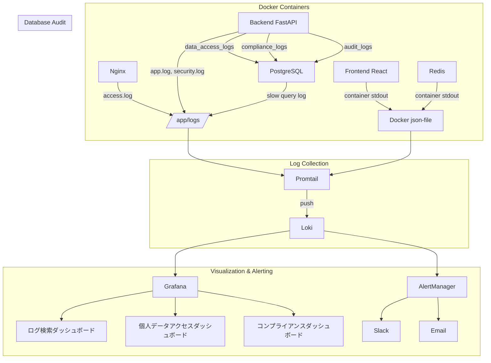

# ログ監査・収集強化仕様書

## 文書管理情報
- **文書番号**: LOG-AUDIT-001
- **版数**: 1.0
- **作成日**: 2026年4月4日
- **最終更新日**: 2026年4月4日
- **設計者**: Claude Code

---

## 1. 概要

### 1.1 目的
本仕様書は、ホームヘルパー管理システムにおける**ログ監査・収集機能の強化**に関する仕様を定義する。高齢者の個人情報・健康情報を扱うシステムとして、改正個人情報保護法への準拠と、セキュリティインシデントの早期検知・対応を実現する。

### 1.2 スコープ

| 機能領域 | 説明 |
|---------|------|
| 集中ログ収集基盤 | Loki + Promtailによるログの一元管理・検索・分析 |
| 個人データアクセス監査 | 誰が・いつ・誰の・どのデータにアクセスしたかの完全追跡 |
| フロントエンドログ収集 | JSエラー、アクセシビリティ機能利用状況の収集 |
| コンプライアンスログ | 改正個人情報保護法対応の記録管理 |
| セキュリティアラート強化 | 異常パターン検知ルールの拡充 |
| ログライフサイクル管理 | 保持ティア、暗号化、完全性検証、自動削除 |

### 1.3 関連文書

| 文書番号 | 文書名 | 関連 |
|---------|-------|------|
| SEC-IMPL-001 | セキュリティ実装仕様書 | セクション6（ログ・監査・監視）を拡張 |
| DB-DESIGN-001 | データベーススキーマ設計書 | 新テーブル3種を追加 |
| API-SPEC-001 | API詳細仕様書 | 新エンドポイント4グループを追加 |
| ADMIN-SPEC-001 | ユーザーアカウント管理システム仕様書 | 監査ログ機能と連携 |
| BACKEND-IMPL-001 | バックエンド実装計画書 | Phase 6として実装フェーズを追加 |

### 1.4 用語定義

| 用語 | 定義 |
|-----|------|
| データアクセスログ | 利用者の個人情報に対するアクセス（閲覧・変更・削除・エクスポート）の記録 |
| コンプライアンスログ | 法令対応に必要な同意取得・権利行使・漏えい対応等の記録 |
| Loki | Grafana Labsが開発する軽量ログ集約システム |
| Promtail | Lokiへログを送信するエージェント |
| LogQL | Lokiのログクエリ言語 |
| HMAC | Hash-based Message Authentication Code（ハッシュベースメッセージ認証コード） |
| チェーンハッシュ | 前エントリのハッシュを次エントリに含める連鎖的なハッシュ |
| PII | Personally Identifiable Information（個人識別情報） |

---

## 2. 集中ログ収集基盤

### 2.1 アーキテクチャ選定: Loki + Promtail

#### 2.1.1 選定理由

| 評価項目 | Loki + Promtail | ELK Stack |
|---------|----------------|-----------|
| **メモリ使用量** | 512MB（Loki）+ 128MB（Promtail） | 2GB+（Elasticsearch単体） |
| **VPS適合性** | 高（軽量、現行8GB VPSに収まる） | 低（メモリ不足リスク） |
| **Grafana統合** | ネイティブ統合（既存Grafanaに追加可能） | Kibana別途必要 |
| **設定複雑度** | 低（2設定ファイル） | 高（ES+Logstash+Kibana各設定） |
| **ストレージ効率** | 高（ラベルのみインデックス化） | 中（全文インデックス） |
| **検索能力** | LogQL（中規模に十分） | 全文検索（大規模向け） |

**結論**: 現行のVPSリソース制約（合計約2.9GBのメモリ使用中）と既存Grafana環境を考慮し、**Loki + Promtail**を採用する。

#### 2.1.2 アーキテクチャ図



### 2.2 ログ収集フロー

#### 2.2.1 Dockerコンテナログ
Promtailが各コンテナの`json-file`ドライバー出力を直接読み取る。**既存のDocker Composeログ設定の変更は不要**。

```yaml
# promtail/promtail-config.yml
server:
  http_listen_port: 9080

positions:
  filename: /tmp/positions.yaml

clients:
  - url: http://loki:3100/loki/api/v1/push

scrape_configs:
  # Docker コンテナログ
  - job_name: docker
    static_configs:
      - targets:
          - localhost
        labels:
          job: docker
          __path__: /var/lib/docker/containers/*/*-json.log
    pipeline_stages:
      - docker: {}
      - labeldrop:
          - filename
      - labels:
          container_name:
```

#### 2.2.2 アプリケーションログ（構造化JSON）
バックエンドのアプリケーションログとセキュリティログをPromtailで収集する。

```yaml
  # アプリケーションログ
  - job_name: app_logs
    static_configs:
      - targets:
          - localhost
        labels:
          job: app
          __path__: /app/logs/app.log
    pipeline_stages:
      - json:
          expressions:
            level: level
            service: service
            trace_id: trace_id
            user_id: user_id
      - labels:
          level:
          service:

  # セキュリティログ
  - job_name: security_logs
    static_configs:
      - targets:
          - localhost
        labels:
          job: security
          __path__: /app/logs/security.log
    pipeline_stages:
      - json:
          expressions:
            event: event
            severity: severity
      - labels:
          event:
          severity:
```

#### 2.2.3 Nginxアクセスログ
```yaml
  # Nginx アクセスログ
  - job_name: nginx
    static_configs:
      - targets:
          - localhost
        labels:
          job: nginx
          __path__: /var/log/nginx/access.log
    pipeline_stages:
      - regex:
          expression: '^(?P<remote_addr>[\w\.]+) .* \[(?P<timestamp>.*)\] "(?P<method>\w+) (?P<path>[^ ]+) .*" (?P<status>\d+) (?P<bytes>\d+)'
      - labels:
          method:
          status:
```

#### 2.2.4 PostgreSQLスロークエリログ
```yaml
  # PostgreSQL スロークエリログ
  - job_name: postgres_slow
    static_configs:
      - targets:
          - localhost
        labels:
          job: postgres
          __path__: /var/log/postgresql/slow_query.log
```

PostgreSQL側の設定（`postgresql.conf`追加）:
```ini
log_min_duration_statement = 1000  # 1秒以上のクエリをログ
log_statement = 'mod'              # INSERT/UPDATE/DELETE をログ
log_destination = 'csvlog'
logging_collector = on
log_directory = '/var/log/postgresql'
log_filename = 'slow_query.log'
```

### 2.3 Docker Compose追加サービス定義

```yaml
# docker-compose.prod.yml への追加

  loki:
    image: grafana/loki:2.9
    container_name: helper-loki
    command: -config.file=/etc/loki/loki-config.yml
    volumes:
      - loki_data:/loki
      - ./loki/loki-config.yml:/etc/loki/loki-config.yml:ro
    ports:
      - "127.0.0.1:3100:3100"
    restart: unless-stopped
    deploy:
      resources:
        limits:
          memory: 512M
          cpus: '0.5'
    healthcheck:
      test: ["CMD", "wget", "--quiet", "--tries=1", "--spider", "http://localhost:3100/ready"]
      interval: 30s
      timeout: 10s
      retries: 3
    logging:
      driver: "json-file"
      options:
        max-size: "5m"
        max-file: "3"
    networks:
      - app-network

  promtail:
    image: grafana/promtail:2.9
    container_name: helper-promtail
    command: -config.file=/etc/promtail/promtail-config.yml
    volumes:
      - /var/lib/docker/containers:/var/lib/docker/containers:ro
      - /var/log:/var/log:ro
      - app_logs:/app/logs:ro
      - ./promtail/promtail-config.yml:/etc/promtail/promtail-config.yml:ro
    restart: unless-stopped
    deploy:
      resources:
        limits:
          memory: 128M
          cpus: '0.25'
    depends_on:
      loki:
        condition: service_healthy
    logging:
      driver: "json-file"
      options:
        max-size: "5m"
        max-file: "3"
    networks:
      - app-network

volumes:
  loki_data:
    driver: local
```

### 2.4 Lokiサーバー設定

```yaml
# loki/loki-config.yml
auth_enabled: false

server:
  http_listen_port: 3100

common:
  ring:
    instance_addr: 127.0.0.1
    kvstore:
      store: inmemory
  replication_factor: 1
  path_prefix: /loki

schema_config:
  configs:
    - from: "2026-04-01"
      store: tsdb
      object_store: filesystem
      schema: v13
      index:
        prefix: index_
        period: 24h

storage_config:
  filesystem:
    directory: /loki/chunks

limits_config:
  retention_period: 744h  # 31日（Hot tier）
  max_query_series: 500
  max_query_length: 744h

compactor:
  working_directory: /loki/compactor
  compaction_interval: 10m
  retention_enabled: true
  retention_delete_delay: 2h
  retention_delete_worker_count: 150

analytics:
  reporting_enabled: false
```

### 2.5 ログ形式標準化

#### 2.5.1 共通フィールド定義

全アプリケーションログは以下の共通フィールドを含む構造化JSONで出力する。

| フィールド | 型 | 必須 | 説明 |
|----------|---|------|------|
| `timestamp` | string (ISO 8601) | Yes | ログ出力日時（UTC） |
| `level` | string | Yes | ログレベル（DEBUG/INFO/WARNING/ERROR/CRITICAL） |
| `service` | string | Yes | サービス名（`backend`, `frontend`, `nginx`, `postgres`） |
| `trace_id` | string (UUID) | Yes | リクエスト追跡ID（全サービス横断） |
| `user_id` | string (UUID) | No | 操作ユーザーID（認証済みの場合） |
| `message` | string | Yes | ログメッセージ |
| `event` | string | No | イベント種別（`auth_attempt`, `data_access` 等） |
| `metadata` | object | No | 追加情報（IPアドレス、ユーザーエージェント等） |

#### 2.5.2 構造化ログ実装

```python
# backend/app/core/structured_logger.py
import logging
import json
import uuid
from datetime import datetime, timezone
from typing import Optional, Dict, Any
from contextvars import ContextVar

# リクエストごとのtrace_id
request_trace_id: ContextVar[str] = ContextVar('request_trace_id', default='')
request_user_id: ContextVar[Optional[str]] = ContextVar('request_user_id', default=None)

class StructuredFormatter(logging.Formatter):
    """構造化JSON形式のログフォーマッタ"""
    
    def format(self, record: logging.LogRecord) -> str:
        log_entry = {
            "timestamp": datetime.now(timezone.utc).isoformat(),
            "level": record.levelname,
            "service": "backend",
            "trace_id": request_trace_id.get('') or str(uuid.uuid4()),
            "message": record.getMessage(),
            "logger": record.name,
        }
        
        # ユーザーID（認証済みの場合）
        user_id = request_user_id.get()
        if user_id:
            log_entry["user_id"] = user_id
        
        # 追加フィールド
        if hasattr(record, 'event'):
            log_entry["event"] = record.event
        if hasattr(record, 'metadata'):
            log_entry["metadata"] = record.metadata
        
        return json.dumps(log_entry, ensure_ascii=False)
```

#### 2.5.3 ログレベル定義

| レベル | 用途 | Lokiでの検索 |
|-------|------|-------------|
| **CRITICAL** | システム停止レベルの障害 | `{level="CRITICAL"}` |
| **ERROR** | エラー（処理継続可能） | `{level="ERROR"}` |
| **WARNING** | 警告（セキュリティイベント含む） | `{level="WARNING"}` |
| **INFO** | 正常操作の記録 | `{level="INFO"}` |
| **DEBUG** | デバッグ情報（本番では無効） | 本番環境では出力しない |

### 2.6 Grafanaデータソース追加

既存のGrafana設定にLokiデータソースを追加する。

```yaml
# grafana/provisioning/datasources/loki.yml
apiVersion: 1

datasources:
  - name: Loki
    type: loki
    access: proxy
    url: http://loki:3100
    isDefault: false
    jsonData:
      maxLines: 1000
      derivedFields:
        - datasourceUid: prometheus
          matcherRegex: "trace_id=(\\w+)"
          name: TraceID
          url: "$${__value.raw}"
```

#### 2.6.1 LogQLクエリ例

```logql
# 直近1時間のセキュリティイベント
{job="security"} | json | severity="critical" | line_format "{{.timestamp}} [{{.event}}] {{.message}}"

# 特定ユーザーの全操作ログ
{job="app"} | json | user_id="<target_user_id>"

# 認証失敗ログ（ブルートフォース検知用）
{job="security"} | json | event="auth_attempt" | success="false"
  | count_over_time({job="security"} | json | event="auth_attempt" | success="false" [5m]) > 5

# HTTPエラーレスポンス
{job="nginx"} | regexp `(?P<status>\d{3})` | status >= 400

# PostgreSQLスロークエリ
{job="postgres"} | line_format "{{.message}}"
```

---

## 3. 個人データアクセス監査ログ

### 3.1 目的と法的根拠

高齢者の個人情報（氏名、住所、電話番号、健康情報等）を扱う本システムでは、**誰が・いつ・誰の・どのデータに・なぜアクセスしたか**を追跡する義務がある。

**法的根拠**:
- **改正個人情報保護法** 第25条: 個人データの取扱い記録の作成義務
- **医療・介護分野におけるサイバーセキュリティ対策ガイドライン**: アクセスログの保管

### 3.2 新規テーブル: data_access_logs

```sql
CREATE TABLE data_access_logs (
    id UUID PRIMARY KEY DEFAULT gen_random_uuid(),
    
    -- 誰がアクセスしたか（WHO）
    accessor_user_id UUID REFERENCES users(id) ON DELETE SET NULL,
    accessor_email VARCHAR(255) NOT NULL,       -- 非正規化（ユーザー削除後も保持）
    accessor_role VARCHAR(20) NOT NULL,         -- 非正規化
    
    -- 誰のデータか（WHOSE）
    target_user_id UUID REFERENCES users(id) ON DELETE SET NULL,
    target_user_name VARCHAR(255) NOT NULL,     -- 非正規化
    
    -- 何にアクセスしたか（WHAT）
    access_type VARCHAR(20) NOT NULL
        CHECK (access_type IN ('read', 'write', 'export', 'delete')),
    resource_type VARCHAR(50) NOT NULL,         -- 'user_profile', 'medical_notes', 'messages', 'tasks', 'shopping'
    data_fields TEXT[],                          -- 具体的フィールド: ['medical_notes', 'phone', 'address']
    
    -- どのようにアクセスしたか（HOW）
    endpoint VARCHAR(200) NOT NULL,
    http_method VARCHAR(10) NOT NULL,
    ip_address INET NOT NULL,
    user_agent TEXT,
    
    -- アクセスコンテキスト
    has_assignment BOOLEAN NOT NULL DEFAULT false,  -- アクセス者は対象者の担当か？
    access_purpose VARCHAR(100),                     -- アクセス目的（任意）
    
    -- ログ完全性
    log_hash VARCHAR(64),                       -- HMAC-SHA256ハッシュ
    
    -- 記録日時
    created_at TIMESTAMP WITH TIME ZONE DEFAULT CURRENT_TIMESTAMP
);

-- インデックス
CREATE INDEX idx_data_access_target ON data_access_logs(target_user_id, created_at);
CREATE INDEX idx_data_access_accessor ON data_access_logs(accessor_user_id, created_at);
CREATE INDEX idx_data_access_type ON data_access_logs(access_type, resource_type);
CREATE INDEX idx_data_access_created ON data_access_logs(created_at);
CREATE INDEX idx_data_access_unassigned ON data_access_logs(has_assignment, created_at)
    WHERE has_assignment = false;
```

**設計ポイント**:
- `accessor_email`, `accessor_role`, `target_user_name` は非正規化。ユーザー削除後もログを保持するため（`audit_logs`と同一パターン）
- `data_fields` はTEXT配列で、アクセスされた具体的フィールドを記録
- `has_assignment = false` の部分インデックスにより、担当外アクセスの異常検知クエリを高速化
- 保持期間: **3年**（改正個人情報保護法の記録保管義務に対応）

### 3.3 記録対象操作

| リソース種別 | 対象エンドポイント | access_type | 記録対象フィールド |
|------------|------------------|------------|------------------|
| **ユーザープロフィール** | `GET /api/v1/users/{id}` | read | full_name, email, phone, address |
| **ユーザープロフィール** | `PUT /api/v1/users/{id}` | write | 変更されたフィールド |
| **医療メモ** | `GET /api/v1/users/{id}` (medical_notes含む) | read | medical_notes |
| **メッセージ** | `GET /api/v1/messages?user_id={id}` | read | message_body |
| **タスク** | `GET /api/v1/tasks?senior_id={id}` | read | task_notes, completion_notes |
| **タスク完了記録** | `GET /api/v1/tasks/{id}/completions` | read | completion_notes, photo_urls |
| **買い物依頼** | `GET /api/v1/shopping?senior_id={id}` | read | items, notes |
| **ユーザー一覧** | `GET /api/v1/admin/users` | read | 一覧表示された全ユーザー |
| **CSVエクスポート** | `GET /api/v1/admin/users/export` | export | エクスポートされた全フィールド |
| **ユーザー無効化** | `PUT /api/v1/admin/users/{id}/deactivate` | write | is_active |
| **ユーザー削除** | 物理削除実行時 | delete | 全フィールド |

### 3.4 実装方式

#### 3.4.1 FastAPIデコレータ方式

個人データアクセスを記録するデコレータを実装し、対象エンドポイントに適用する。

```python
# backend/app/middleware/data_access_logger.py
from functools import wraps
from typing import List, Optional
import hashlib
import hmac

class DataAccessLogger:
    def __init__(self, db_session_factory, hmac_key: str):
        self.db_session_factory = db_session_factory
        self.hmac_key = hmac_key.encode()
        self._buffer: List[dict] = []
        self._buffer_lock = asyncio.Lock()
    
    def track_access(
        self,
        resource_type: str,
        access_type: str = "read",
        data_fields: Optional[List[str]] = None,
        target_user_id_param: str = "user_id"
    ):
        """個人データアクセス記録デコレータ"""
        def decorator(func):
            @wraps(func)
            async def wrapper(*args, **kwargs):
                request = kwargs.get('request')
                current_user = kwargs.get('current_user')
                target_id = kwargs.get(target_user_id_param)
                
                result = await func(*args, **kwargs)
                
                # 自分自身のデータアクセスは記録しない
                if current_user and target_id and str(current_user.id) != str(target_id):
                    await self._buffer_log({
                        "accessor_user_id": str(current_user.id),
                        "accessor_email": current_user.email,
                        "accessor_role": current_user.role,
                        "target_user_id": str(target_id),
                        "access_type": access_type,
                        "resource_type": resource_type,
                        "data_fields": data_fields,
                        "endpoint": str(request.url.path),
                        "http_method": request.method,
                        "ip_address": request.client.host,
                        "user_agent": request.headers.get("user-agent", ""),
                    })
                
                return result
            return wrapper
        return decorator
    
    async def _buffer_log(self, log_data: dict):
        """ログをバッファに追加（非同期バッチ書き込み）"""
        # HMAC署名を付与
        log_data["log_hash"] = self._compute_hmac(log_data)
        
        async with self._buffer_lock:
            self._buffer.append(log_data)
            if len(self._buffer) >= 50:  # 50件溜まったらフラッシュ
                await self._flush()
    
    async def _flush(self):
        """バッファをDBに一括書き込み"""
        if not self._buffer:
            return
        logs_to_write = self._buffer.copy()
        self._buffer.clear()
        
        async with self.db_session_factory() as session:
            # バルクインサート
            await session.execute(
                data_access_logs.insert(),
                logs_to_write
            )
            await session.commit()
    
    def _compute_hmac(self, log_data: dict) -> str:
        """ログエントリのHMAC-SHA256署名を計算"""
        message = json.dumps(log_data, sort_keys=True, default=str)
        return hmac.new(self.hmac_key, message.encode(), hashlib.sha256).hexdigest()
```

#### 3.4.2 定期フラッシュ（バックグラウンドタスク）

```python
# backend/app/core/background_tasks.py
from apscheduler.schedulers.asyncio import AsyncIOScheduler

async def setup_data_access_flush(app):
    """5秒ごとにバッファをフラッシュ"""
    scheduler = AsyncIOScheduler()
    scheduler.add_job(
        data_access_logger._flush,
        'interval',
        seconds=5,
        id='data_access_flush'
    )
    scheduler.start()
```

**パフォーマンス考慮**:
- バッファリングにより、個別のDB書き込みを回避
- 50件蓄積 or 5秒経過でバッチ書き込み
- 非同期処理のため、APIレスポンスタイムに影響しない

### 3.5 APIエンドポイント

#### 3.5.1 データアクセスログ検索
```http
GET /api/v1/admin/data-access-logs
Authorization: Bearer <access_token>
```

**クエリパラメータ**:

| パラメータ | 型 | 必須 | 説明 |
|----------|---|------|------|
| `accessor_user_id` | UUID | No | アクセス者のユーザーID |
| `target_user_id` | UUID | No | アクセス対象のユーザーID |
| `access_type` | string | No | アクセス種別（read/write/export/delete） |
| `resource_type` | string | No | リソース種別 |
| `has_assignment` | boolean | No | 担当関係の有無 |
| `date_from` | datetime | No | 期間開始 |
| `date_to` | datetime | No | 期間終了 |
| `page` | integer | No | ページ番号（デフォルト: 1） |
| `limit` | integer | No | 取得件数（デフォルト: 50、最大: 100） |

**成功レスポンス (200 OK)**:
```json
{
  "data_access_logs": [
    {
      "id": "550e8400-e29b-41d4-a716-446655440000",
      "accessor_user_id": "123e4567-e89b-12d3-a456-426614174001",
      "accessor_email": "helper@example.com",
      "accessor_role": "helper",
      "target_user_id": "123e4567-e89b-12d3-a456-426614174002",
      "target_user_name": "田中花子",
      "access_type": "read",
      "resource_type": "user_profile",
      "data_fields": ["full_name", "phone", "medical_notes"],
      "endpoint": "/api/v1/users/123e4567-e89b-12d3-a456-426614174002",
      "http_method": "GET",
      "ip_address": "192.168.1.100",
      "has_assignment": true,
      "created_at": "2026-04-04T09:30:00Z"
    }
  ],
  "pagination": {
    "page": 1,
    "limit": 50,
    "total": 1500,
    "total_pages": 30
  }
}
```

**権限**: `system:admin`のみ

#### 3.5.2 データアクセス集計レポート
```http
GET /api/v1/admin/data-access-logs/report
Authorization: Bearer <access_token>
```

**クエリパラメータ**:

| パラメータ | 型 | 必須 | 説明 |
|----------|---|------|------|
| `period` | string | No | 集計期間（daily/weekly/monthly、デフォルト: daily） |
| `date_from` | datetime | Yes | 集計開始日 |
| `date_to` | datetime | Yes | 集計終了日 |
| `group_by` | string | No | グループ化項目（accessor/target/resource_type） |

**成功レスポンス (200 OK)**:
```json
{
  "report": {
    "period": "daily",
    "date_from": "2026-04-01T00:00:00Z",
    "date_to": "2026-04-04T23:59:59Z",
    "summary": {
      "total_access_count": 4250,
      "unique_accessors": 15,
      "unique_targets": 120,
      "unassigned_access_count": 3,
      "export_count": 2
    },
    "by_date": [
      {
        "date": "2026-04-01",
        "read_count": 1050,
        "write_count": 120,
        "export_count": 1,
        "delete_count": 0
      }
    ],
    "anomalies": [
      {
        "type": "unassigned_access",
        "accessor_email": "helper2@example.com",
        "target_user_name": "佐藤太郎",
        "count": 3,
        "first_at": "2026-04-03T14:20:00Z"
      }
    ]
  }
}
```

**権限**: `system:admin`のみ

#### 3.5.3 特定利用者のアクセス履歴
```http
GET /api/v1/admin/data-access-logs/user/{user_id}
Authorization: Bearer <access_token>
```

特定の利用者（高齢者）のデータに対する全アクセス履歴を取得する。コンプライアンス監査や開示請求への対応に使用する。

**成功レスポンス**: 3.5.1と同一形式（`target_user_id`で自動フィルタ）

---

## 4. フロントエンドログ収集

### 4.1 エラーバウンダリログ

#### 4.1.1 React Error Boundary統合

```typescript
// frontend/src/components/ErrorBoundary.tsx
interface FrontendErrorLog {
  type: 'js_error' | 'unhandled_rejection' | 'render_error' | 'network_error';
  message: string;
  stack?: string;
  component_name?: string;
  url: string;
  user_agent: string;
  timestamp: string;
  // PII除外: user_idは含めるが、ユーザー入力値は含めない
  user_id?: string;
  user_role?: string;
}

class ErrorBoundary extends React.Component<Props, State> {
  componentDidCatch(error: Error, errorInfo: React.ErrorInfo) {
    const logEntry: FrontendErrorLog = {
      type: 'render_error',
      message: error.message,
      stack: error.stack?.substring(0, 2000),  // スタック長制限
      component_name: errorInfo.componentStack?.split('\n')[1]?.trim(),
      url: window.location.pathname,
      user_agent: navigator.userAgent,
      timestamp: new Date().toISOString(),
    };
    
    FrontendLogger.send(logEntry);
  }
}
```

#### 4.1.2 未ハンドルPromise拒否の捕捉

```typescript
// frontend/src/utils/global-error-handler.ts
window.addEventListener('unhandledrejection', (event) => {
  FrontendLogger.send({
    type: 'unhandled_rejection',
    message: event.reason?.message || String(event.reason),
    stack: event.reason?.stack?.substring(0, 2000),
    url: window.location.pathname,
    user_agent: navigator.userAgent,
    timestamp: new Date().toISOString(),
  });
});

window.addEventListener('error', (event) => {
  FrontendLogger.send({
    type: 'js_error',
    message: event.message,
    stack: `${event.filename}:${event.lineno}:${event.colno}`,
    url: window.location.pathname,
    user_agent: navigator.userAgent,
    timestamp: new Date().toISOString(),
  });
});
```

### 4.2 アクセシビリティ機能利用ログ

高齢者向けUIの利用状況を追跡し、機能改善に活用する。

| イベント | 記録内容 | 目的 |
|---------|---------|------|
| **フォントサイズ変更** | 変更前後のサイズ | 適切なデフォルトサイズの判断 |
| **高コントラストモード** | ON/OFF切替 | 利用率の把握 |
| **スクリーンリーダー検出** | 検出有無 | 対応優先度の判断 |
| **キーボードナビゲーション** | Tab/Enter使用率 | キーボード操作の改善 |
| **QRコード認証利用** | QR認証の使用回数 | パスワード認証との利用比率 |

```typescript
// frontend/src/utils/accessibility-logger.ts
interface AccessibilityEvent {
  type: 'accessibility_usage';
  feature: string;        // 'font_size' | 'high_contrast' | 'screen_reader' | 'keyboard_nav' | 'qr_auth'
  action: string;         // 'enable' | 'disable' | 'change'
  value?: string;         // 変更後の値
  previous_value?: string;
  timestamp: string;
}
```

### 4.3 ログ送信方式: Navigator.sendBeacon() API

#### 4.3.1 Beacon API選定理由

| 評価項目 | Beacon API | XMLHttpRequest/Fetch |
|---------|-----------|---------------------|
| **ページアンロード時** | 確実に送信 | 送信が中断される可能性 |
| **ブロッキング** | 非ブロッキング | 同期的に使うとブロッキング |
| **高齢者ユーザー対応** | タブ閉じ・ブラウザ終了時も送信 | 高齢者の突然の操作終了に弱い |
| **ペイロード制限** | 64KB | 制限なし |

**Beacon APIを主、Fetchフォールバックを副**として実装する。

#### 4.3.2 バッファリングとバッチ送信

```typescript
// frontend/src/utils/frontend-logger.ts
class FrontendLoggerImpl {
  private buffer: Array<FrontendErrorLog | AccessibilityEvent> = [];
  private readonly MAX_BUFFER_SIZE = 50;
  private readonly FLUSH_INTERVAL_MS = 10000;  // 10秒
  private readonly ENDPOINT = '/api/v1/telemetry/frontend-logs';
  
  constructor() {
    // 定期フラッシュ
    setInterval(() => this.flush(), this.FLUSH_INTERVAL_MS);
    
    // ページアンロード時のフラッシュ
    window.addEventListener('visibilitychange', () => {
      if (document.visibilityState === 'hidden') {
        this.flush();
      }
    });
  }
  
  send(entry: FrontendErrorLog | AccessibilityEvent): void {
    // PII除外フィルタ
    const sanitized = this.sanitize(entry);
    this.buffer.push(sanitized);
    
    if (this.buffer.length >= this.MAX_BUFFER_SIZE) {
      this.flush();
    }
  }
  
  private flush(): void {
    if (this.buffer.length === 0) return;
    
    const payload = JSON.stringify({
      logs: this.buffer,
      client_timestamp: new Date().toISOString(),
    });
    this.buffer = [];
    
    // Beacon API で送信（フォールバック付き）
    const sent = navigator.sendBeacon?.(this.ENDPOINT, payload);
    if (!sent) {
      // フォールバック: fetch
      fetch(this.ENDPOINT, {
        method: 'POST',
        headers: { 'Content-Type': 'application/json' },
        body: payload,
        keepalive: true,
      }).catch(() => {});  // 送信失敗は許容
    }
  }
  
  private sanitize(entry: any): any {
    // ユーザー入力値をマスク
    const sanitized = { ...entry };
    if (sanitized.stack) {
      // スタックトレースからファイルパスの個人情報部分を除去
      sanitized.stack = sanitized.stack.replace(/\/users\/[^/]+\//g, '/users/***/');
    }
    return sanitized;
  }
}

export const FrontendLogger = new FrontendLoggerImpl();
```

### 4.4 受信エンドポイント

```http
POST /api/v1/telemetry/frontend-logs
Content-Type: application/json
```

**レート制限**: 10リクエスト/分/ユーザー（認証不要だがトークンがあれば`user_id`を付与）

**リクエストボディ**:
```json
{
  "logs": [
    {
      "type": "js_error",
      "message": "Cannot read property 'name' of undefined",
      "stack": "TypeError: Cannot read property...",
      "url": "/dashboard",
      "user_agent": "Mozilla/5.0...",
      "timestamp": "2026-04-04T10:00:00Z"
    },
    {
      "type": "accessibility_usage",
      "feature": "font_size",
      "action": "change",
      "value": "24px",
      "previous_value": "18px",
      "timestamp": "2026-04-04T10:01:00Z"
    }
  ],
  "client_timestamp": "2026-04-04T10:01:05Z"
}
```

**成功レスポンス (202 Accepted)**:
```json
{
  "accepted": true,
  "count": 2
}
```

**処理フロー**:
1. バリデーション（ペイロードサイズ上限: 64KB）
2. PII含有チェック（メールアドレスパターン等の検出・除去）
3. 構造化ログとしてアプリケーションログに出力（Promtail経由でLokiへ）
4. エラーログはfrontend_error_logsテーブルに集約（重複排除）

---

## 5. コンプライアンスログ（改正個人情報保護法対応）

### 5.1 法的要件の整理

| 条項 | 要件 | 本システムでの対応 |
|------|------|------------------|
| **第17条** | 利用目的の特定・通知 | 同意取得ログで記録 |
| **第23条** | 第三者提供の制限と記録 | データアクセスログ + コンプライアンスログ |
| **第25条** | 個人データの取扱い記録の作成 | data_access_logsテーブル |
| **第28条** | 本人からの開示請求への対応 | データ主体権利行使ログ |
| **第29条** | 訂正・追加・削除請求への対応 | データ主体権利行使ログ |
| **第26条** | 漏えい等報告（個人情報保護委員会） | 漏えいインシデントログ |
| **第26条第2項** | 本人通知義務 | 本人通知記録 |

### 5.2 新規テーブル: compliance_logs

```sql
CREATE TABLE compliance_logs (
    id UUID PRIMARY KEY DEFAULT gen_random_uuid(),
    
    -- イベント種別
    event_type VARCHAR(50) NOT NULL
        CHECK (event_type IN (
            'consent_given',           -- 同意取得
            'consent_withdrawn',       -- 同意撤回
            'disclosure_request',      -- 開示請求
            'correction_request',      -- 訂正請求
            'deletion_request',        -- 削除請求
            'usage_stop_request',      -- 利用停止請求
            'breach_detected',         -- 漏えい検知
            'breach_reported_ppc',     -- 個人情報保護委員会への報告
            'breach_notified_user',    -- 本人通知
            'retention_expired',       -- 保持期間超過
            'data_deleted',            -- データ削除実行
            'third_party_provision'    -- 第三者提供記録
        )),
    
    -- 対象者
    target_user_id UUID REFERENCES users(id) ON DELETE SET NULL,
    target_user_name VARCHAR(255),          -- 非正規化
    
    -- 操作者（管理者）
    handled_by UUID REFERENCES users(id) ON DELETE SET NULL,
    handler_email VARCHAR(255),             -- 非正規化
    
    -- 請求・イベント詳細
    request_details JSONB NOT NULL,
    
    -- ステータス管理
    status VARCHAR(20) NOT NULL DEFAULT 'pending'
        CHECK (status IN ('pending', 'in_progress', 'completed', 'rejected')),
    
    -- 期限管理
    deadline_at TIMESTAMP WITH TIME ZONE,   -- 対応期限
    completed_at TIMESTAMP WITH TIME ZONE,  -- 完了日時
    
    -- 証跡
    response_details JSONB,                 -- 対応結果の詳細
    
    -- ログ完全性
    log_hash VARCHAR(64),
    
    -- 記録日時
    created_at TIMESTAMP WITH TIME ZONE DEFAULT CURRENT_TIMESTAMP,
    updated_at TIMESTAMP WITH TIME ZONE DEFAULT CURRENT_TIMESTAMP
);

-- インデックス
CREATE INDEX idx_compliance_event_type ON compliance_logs(event_type);
CREATE INDEX idx_compliance_target ON compliance_logs(target_user_id, created_at);
CREATE INDEX idx_compliance_status ON compliance_logs(status) WHERE status != 'completed';
CREATE INDEX idx_compliance_deadline ON compliance_logs(deadline_at) WHERE status = 'pending';
CREATE INDEX idx_compliance_created ON compliance_logs(created_at);
```

**設計ポイント**:
- 保持期間: **3年**（法定保管義務に対応）
- `status != 'completed'` の部分インデックスにより、未対応案件（pending/in_progress）の検索を高速化
- `deadline_at` で対応期限を管理（開示請求は2週間以内、漏えい報告は72時間以内）
- `request_details`/`response_details` はJSONBで、イベント種別ごとに異なる詳細を柔軟に格納

### 5.3 同意ログ

#### 5.3.1 記録対象

| イベント | event_type | request_details |
|---------|-----------|-----------------|
| 利用規約同意 | `consent_given` | `{"consent_type": "terms_of_service", "version": "1.0"}` |
| 個人情報取扱い同意 | `consent_given` | `{"consent_type": "privacy_policy", "version": "1.0", "scope": ["personal_info", "health_info"]}` |
| 同意撤回 | `consent_withdrawn` | `{"consent_type": "privacy_policy", "reason": "ユーザー希望"}` |

#### 5.3.2 同意取得フロー
1. ユーザー登録時に利用規約・プライバシーポリシーへの同意を取得
2. 同意内容をcomplianceログに記録
3. ポリシー変更時は再同意を要求し、新バージョンで記録

### 5.4 データ主体権利行使ログ

#### 5.4.1 開示請求フロー

```
利用者 → 開示請求 → compliance_log作成(disclosure_request, status=pending)
    → 管理者確認 → 本人確認実施
    → データ抽出 → compliance_log更新(status=in_progress)
    → 開示実行 → compliance_log更新(status=completed, response_details)
```

**request_details 例**:
```json
{
  "request_type": "disclosure",
  "requested_data": ["personal_info", "access_logs", "messages"],
  "identity_verified": true,
  "identity_method": "本人確認書類",
  "received_via": "書面"
}
```

**response_details 例**:
```json
{
  "disclosed_data": ["personal_info", "access_logs"],
  "excluded_data": [],
  "exclusion_reason": null,
  "delivery_method": "書面郵送",
  "delivered_at": "2026-04-10T10:00:00Z"
}
```

#### 5.4.2 訂正・削除請求

| 請求種別 | event_type | deadline（法定） |
|---------|-----------|----------------|
| 開示請求 | `disclosure_request` | 2週間以内 |
| 訂正請求 | `correction_request` | 2週間以内 |
| 削除請求 | `deletion_request` | 2週間以内 |
| 利用停止請求 | `usage_stop_request` | 2週間以内 |

### 5.5 漏えいインシデント通知ログ

#### 5.5.1 漏えい報告タイムライン

| 段階 | event_type | 期限 | 対象 |
|------|-----------|------|------|
| 漏えい検知 | `breach_detected` | 即時 | 社内記録 |
| 速報報告 | `breach_reported_ppc` | **3〜5日以内** | 個人情報保護委員会 |
| 本人通知 | `breach_notified_user` | **速やかに** | 影響を受けた本人 |
| 確報報告 | `breach_reported_ppc` | **30日以内** | 個人情報保護委員会 |

**request_details 例（漏えい検知）**:
```json
{
  "incident_type": "unauthorized_access",
  "description": "不正アクセスにより利用者3名の個人情報が閲覧された可能性",
  "affected_users_count": 3,
  "affected_data_types": ["full_name", "phone", "medical_notes"],
  "detection_method": "security_alert",
  "severity": "high"
}
```

### 5.6 データ保持期間と削除証跡

#### 5.6.1 保持期間一覧

| データ種別 | 保持期間 | 根拠 |
|----------|---------|------|
| **利用者データ** | 3年 | 事業上の必要性 |
| **監査ログ（audit_logs）** | 6ヶ月 | 運用上の必要性 |
| **データアクセスログ** | 3年 | 改正個人情報保護法 |
| **コンプライアンスログ** | 3年 | 改正個人情報保護法 |
| **フロントエンドエラーログ** | 90日 | 運用上の必要性 |
| **アプリケーションログ（Loki）** | 31日（Hot） | 運用上の必要性 |

#### 5.6.2 削除バッチ処理

```python
# backend/app/tasks/data_retention.py
async def run_retention_cleanup():
    """保持期間超過データの自動削除バッチ"""
    
    # 1. audit_logs: 6ヶ月超過分を削除
    deleted_audit = await cleanup_table(
        'audit_logs', retention_months=6
    )
    
    # 2. data_access_logs: 3年超過分を削除
    deleted_access = await cleanup_table(
        'data_access_logs', retention_years=3
    )
    
    # 3. compliance_logs: 3年超過分を削除（completed のみ）
    deleted_compliance = await cleanup_table(
        'compliance_logs', retention_years=3,
        condition="status = 'completed'"
    )
    
    # 4. frontend_error_logs: 90日超過分を削除
    deleted_frontend = await cleanup_table(
        'frontend_error_logs', retention_days=90
    )
    
    # 5. 削除実行をコンプライアンスログに記録
    await create_compliance_log(
        event_type='data_deleted',
        request_details={
            "batch_type": "retention_cleanup",
            "deleted_counts": {
                "audit_logs": deleted_audit,
                "data_access_logs": deleted_access,
                "compliance_logs": deleted_compliance,
                "frontend_error_logs": deleted_frontend,
            },
            "executed_at": datetime.utcnow().isoformat()
        }
    )
```

### 5.7 APIエンドポイント

#### 5.7.1 同意ログ
```http
GET /api/v1/admin/compliance/consent-logs
Authorization: Bearer <access_token>
```

| パラメータ | 型 | 必須 | 説明 |
|----------|---|------|------|
| `target_user_id` | UUID | No | 対象ユーザーID |
| `consent_type` | string | No | 同意種別 |
| `date_from` | datetime | No | 期間開始 |
| `date_to` | datetime | No | 期間終了 |
| `page` | integer | No | ページ番号（デフォルト: 1） |
| `limit` | integer | No | 取得件数（デフォルト: 50） |

**権限**: `system:admin`のみ

#### 5.7.2 データ主体権利行使ログ
```http
GET /api/v1/admin/compliance/data-requests
Authorization: Bearer <access_token>
```

| パラメータ | 型 | 必須 | 説明 |
|----------|---|------|------|
| `status` | string | No | ステータス（pending/in_progress/completed/rejected） |
| `event_type` | string | No | 請求種別 |
| `target_user_id` | UUID | No | 対象ユーザーID |
| `page` | integer | No | ページ番号 |
| `limit` | integer | No | 取得件数 |

```http
POST /api/v1/admin/compliance/data-requests
Authorization: Bearer <access_token>
Content-Type: application/json
```

**リクエストボディ**:
```json
{
  "event_type": "disclosure_request",
  "target_user_id": "123e4567-e89b-12d3-a456-426614174002",
  "request_details": {
    "request_type": "disclosure",
    "requested_data": ["personal_info", "access_logs"],
    "identity_verified": true,
    "identity_method": "本人確認書類",
    "received_via": "書面"
  }
}
```

```http
PATCH /api/v1/admin/compliance/data-requests/{id}
Authorization: Bearer <access_token>
Content-Type: application/json
```

**リクエストボディ**:
```json
{
  "status": "completed",
  "response_details": {
    "disclosed_data": ["personal_info", "access_logs"],
    "delivery_method": "書面郵送",
    "delivered_at": "2026-04-10T10:00:00Z"
  }
}
```

**権限**: `system:admin`のみ

#### 5.7.3 漏えい報告
```http
GET /api/v1/admin/compliance/breach-reports
Authorization: Bearer <access_token>
```

```http
POST /api/v1/admin/compliance/breach-reports
Authorization: Bearer <access_token>
Content-Type: application/json
```

**リクエストボディ**:
```json
{
  "event_type": "breach_detected",
  "request_details": {
    "incident_type": "unauthorized_access",
    "description": "不正アクセスの検知",
    "affected_users_count": 3,
    "affected_data_types": ["full_name", "phone"],
    "detection_method": "security_alert",
    "severity": "high"
  }
}
```

**権限**: `system:admin`のみ

#### 5.7.4 データ保持状況レポート
```http
GET /api/v1/admin/compliance/retention-report
Authorization: Bearer <access_token>
```

**成功レスポンス (200 OK)**:
```json
{
  "retention_report": {
    "generated_at": "2026-04-04T12:00:00Z",
    "tables": [
      {
        "table_name": "audit_logs",
        "retention_period": "6 months",
        "total_records": 15000,
        "oldest_record": "2025-10-04T00:00:00Z",
        "records_due_for_deletion": 500,
        "next_cleanup_at": "2026-04-05T03:00:00Z"
      },
      {
        "table_name": "data_access_logs",
        "retention_period": "3 years",
        "total_records": 250000,
        "oldest_record": "2026-04-04T00:00:00Z",
        "records_due_for_deletion": 0,
        "next_cleanup_at": "2026-04-05T03:00:00Z"
      }
    ],
    "pending_requests": {
      "disclosure_requests": 1,
      "correction_requests": 0,
      "deletion_requests": 0,
      "overdue_requests": 0
    }
  }
}
```

**権限**: `system:admin`のみ

---

## 6. セキュリティアラートルール

### 6.1 ブルートフォース検知（既存強化）

既存の`SecurityMonitor`（セキュリティ実装仕様書 セクション6.2）を拡張する。

| ルール | 条件 | 重要度 | 対応 |
|-------|------|-------|------|
| **IP別ブルートフォース** | 同一IPから5回失敗/30分 | Medium | IPロック30分（既存） |
| **アカウント別ブルートフォース** | 同一アカウントに10回失敗/1時間 | High | アカウント一時停止 + 管理者通知 |
| **分散ブルートフォース** | 同一IPから3+アカウントに失敗/1時間 | Critical | IP即時ブロック + 緊急通知 |

```python
# backend/app/core/security_monitor.py 追加メソッド

async def check_distributed_brute_force(self, ip_address: str) -> bool:
    """分散ブルートフォース検知: 同一IPから複数アカウントへの失敗"""
    key = f"failed_login_accounts:{ip_address}"
    accounts = await self.redis_client.smembers(key)
    
    if len(accounts) >= 3:
        await self._send_security_alert(
            "Distributed brute force detected",
            f"IP {ip_address} attempted login to {len(accounts)} different accounts",
            "critical"
        )
        security_logger.log_security_incident(
            "distributed_brute_force",
            f"IP {ip_address}: {len(accounts)} accounts targeted",
            "critical",
            ip_address
        )
        return False
    return True
```

### 6.2 権限昇格検知

| ルール | 条件 | 重要度 | 対応 |
|-------|------|-------|------|
| **ロール変更監視** | ロールが変更された | Info | 監査ログに記録 |
| **権限外アクセス繰返** | 同一ユーザーから5回以上の403/1時間 | High | アカウント調査 + 管理者通知 |
| **管理者ロール付与** | system_adminロールが付与された | Critical | 即時通知 + 承認確認 |

```python
async def check_privilege_escalation(self, user_id: str, endpoint: str, 
                                      status_code: int):
    """権限昇格/不正アクセス繰返し検知"""
    if status_code == 403:
        key = f"forbidden_access:{user_id}"
        count = await self.redis_client.incr(key)
        await self.redis_client.expire(key, 3600)
        
        if count >= 5:
            await self._send_security_alert(
                "Repeated unauthorized access attempts",
                f"User {user_id} has been denied access {count} times in the last hour. "
                f"Latest endpoint: {endpoint}",
                "high"
            )
```

### 6.3 異常データアクセスパターン

| ルール | 条件 | 重要度 | 対応 |
|-------|------|-------|------|
| **大量個人情報閲覧** | 1時間以内に50件以上の異なるユーザーデータにアクセス | High | 管理者通知 + アクセス制限 |
| **担当外アクセス** | has_assignment=falseのデータアクセス | Medium | 管理者通知 |
| **深夜帯アクセス** | 22:00-6:00 (JST) に個人情報にアクセス | Medium | 管理者通知 |
| **連続エクスポート** | 1日に3回以上のCSVエクスポート | High | 管理者通知 + エクスポート一時停止 |

```python
async def check_abnormal_data_access(self, user_id: str, target_user_id: str,
                                      access_type: str):
    """異常データアクセスパターン検知"""
    
    # 大量閲覧チェック
    key = f"data_access_targets:{user_id}"
    await self.redis_client.sadd(key, target_user_id)
    await self.redis_client.expire(key, 3600)
    target_count = await self.redis_client.scard(key)
    
    if target_count >= 50:
        await self._send_security_alert(
            "Bulk personal data access detected",
            f"User {user_id} accessed {target_count} different users' data in 1 hour",
            "high"
        )
    
    # 深夜帯チェック（JST: UTC+9）
    jst_hour = (datetime.utcnow().hour + 9) % 24
    if jst_hour >= 22 or jst_hour < 6:
        await self._send_security_alert(
            "Off-hours personal data access",
            f"User {user_id} accessed personal data at {jst_hour}:00 JST",
            "medium"
        )
    
    # エクスポートチェック
    if access_type == "export":
        export_key = f"export_count:{user_id}:{datetime.utcnow().strftime('%Y%m%d')}"
        count = await self.redis_client.incr(export_key)
        await self.redis_client.expire(export_key, 86400)
        
        if count >= 3:
            await self._send_security_alert(
                "Excessive data export detected",
                f"User {user_id} has exported data {count} times today",
                "high"
            )
```

### 6.4 セッション異常検知

| ルール | 条件 | 重要度 | 対応 |
|-------|------|-------|------|
| **同時多重ログイン** | 同一ユーザーが3+異なるIPからアクティブ | High | 管理者通知 + 古いセッション無効化 |
| **急激なIP変更** | 5分以内にIPが変更 | Medium | 再認証要求 |

### 6.5 Prometheus/Lokiアラートルール

```yaml
# prometheus/alert-rules/security-alerts.yml
groups:
  - name: security_alerts
    rules:
      # ブルートフォース検知
      - alert: BruteForceDetected
        expr: |
          sum by (ip_address) (
            count_over_time({job="security"} | json | event="auth_attempt" | success="false" [30m])
          ) > 5
        for: 0m
        labels:
          severity: warning
        annotations:
          summary: "ブルートフォース攻撃検知: {{ $labels.ip_address }}"
          
      # 担当外データアクセス
      - alert: UnassignedDataAccess
        expr: |
          count_over_time({job="app"} | json | event="personal_data_access" | has_assignment="false" [1h]) > 0
        for: 0m
        labels:
          severity: warning
        annotations:
          summary: "担当外利用者データへのアクセス検知"
          
      # 大量データエクスポート
      - alert: ExcessiveDataExport
        expr: |
          sum by (user_id) (
            count_over_time({job="app"} | json | event="personal_data_access" | access_type="export" [24h])
          ) >= 3
        for: 0m
        labels:
          severity: critical
        annotations:
          summary: "大量データエクスポート検知: ユーザー {{ $labels.user_id }}"
          
      # ログ完全性検証失敗
      - alert: LogIntegrityFailure
        expr: |
          count_over_time({job="app"} | json | event="log_integrity_failure" [1h]) > 0
        for: 0m
        labels:
          severity: critical
        annotations:
          summary: "ログ完全性検証失敗 - 改ざんの可能性"
```

### 6.6 AlertManagerルーティング設定

```yaml
# alertmanager/alertmanager.yml 追加
route:
  routes:
    # Criticalアラート → 即時Slack + メール
    - match:
        severity: critical
      receiver: critical_alerts
      repeat_interval: 15m
      
    # Warningアラート → Slackのみ
    - match:
        severity: warning
      receiver: warning_alerts
      repeat_interval: 1h

receivers:
  - name: critical_alerts
    slack_configs:
      - channel: '#security-alerts'
        title: '🚨 [CRITICAL] {{ .CommonAnnotations.summary }}'
        text: '{{ .CommonAnnotations.description }}'
    email_configs:
      - to: 'security-team@example.com'
        
  - name: warning_alerts
    slack_configs:
      - channel: '#security-alerts'
        title: '⚠️ [WARNING] {{ .CommonAnnotations.summary }}'
```

---

## 7. ログライフサイクル管理

### 7.1 保持期間ティア

```
┌────────────────────────────────────────────────────────┐
│ Hot (0-30日)                                            │
│ Loki即時検索 / 全ログ / SSD                             │
├────────────────────────────────────────────────────────┤
│ Warm (30-180日)                                         │
│ 圧縮保存 / セキュリティ・アクセス・コンプライアンスログ   │
│ 検索可能（遅延あり）                                     │
├────────────────────────────────────────────────────────┤
│ Cold (180日-3年)                                        │
│ 圧縮+暗号化アーカイブ / コンプライアンスログのみ          │
│ 手動復元で検索可能                                       │
├────────────────────────────────────────────────────────┤
│ Delete (3年超過)                                        │
│ 削除証明書付きパージ                                     │
└────────────────────────────────────────────────────────┘
```

#### 7.1.1 ティア別データ種別マッピング

| データ種別 | Hot | Warm | Cold | Delete |
|----------|-----|------|------|--------|
| アプリケーションログ | 31日 | - | - | 31日超過 |
| Nginxアクセスログ | 31日 | - | - | 31日超過 |
| セキュリティログ | 31日 | 180日 | - | 180日超過 |
| 監査ログ（audit_logs） | 31日 | 180日 | - | 6ヶ月超過 |
| データアクセスログ | 31日 | 180日 | 3年 | 3年超過 |
| コンプライアンスログ | 31日 | 180日 | 3年 | 3年超過 |
| フロントエンドエラーログ | 31日 | 90日 | - | 90日超過 |

### 7.2 アーカイブ

#### 7.2.1 ローカルディスクアーカイブ

VPS環境のため、ローカルディスクにアーカイブする。ストレージ容量を考慮し、gzip圧縮を適用する。

```bash
# scripts/archive-logs.sh
#!/bin/bash
ARCHIVE_DIR="/opt/home-helper-system/log-archives"
DATE=$(date -d "30 days ago" +%Y-%m-%d)

# Warm tier: 30日超過のDBログをエクスポート
docker-compose -f docker-compose.prod.yml exec -T postgres psql -U $POSTGRES_USER -d $POSTGRES_DB \
  -c "\COPY (SELECT * FROM data_access_logs WHERE created_at < '$DATE') TO STDOUT WITH CSV HEADER" \
  | gzip > "$ARCHIVE_DIR/data_access_logs_before_${DATE}.csv.gz"

# Cold tier: 180日超過分を暗号化アーカイブ
COLD_DATE=$(date -d "180 days ago" +%Y-%m-%d)
openssl enc -aes-256-cbc -salt \
  -in "$ARCHIVE_DIR/data_access_logs_before_${COLD_DATE}.csv.gz" \
  -out "$ARCHIVE_DIR/cold/data_access_logs_before_${COLD_DATE}.csv.gz.enc" \
  -pass file:/opt/home-helper-system/.archive-key
```

#### 7.2.2 アーカイブ命名規則

```
log-archives/
├── warm/
│   ├── data_access_logs_2026-03.csv.gz
│   ├── compliance_logs_2026-03.csv.gz
│   └── security_logs_2026-03.csv.gz
├── cold/
│   ├── data_access_logs_2025-10.csv.gz.enc
│   └── compliance_logs_2025-10.csv.gz.enc
└── checksums/
    ├── 2026-03_sha256sums.txt
    └── 2025-10_sha256sums.txt
```

### 7.3 ログ暗号化

#### 7.3.1 保存時暗号化

| 対象 | 暗号化方式 | 鍵管理 |
|------|----------|--------|
| **Coldアーカイブ** | AES-256-CBC | ファイルベース鍵（`/opt/home-helper-system/.archive-key`） |
| **DB内データ** | PostgreSQL pgcrypto | DB設定ベース |
| **Loki保存データ** | ファイルシステム暗号化（LUKS推奨） | OS設定ベース |

#### 7.3.2 鍵管理
- アーカイブ暗号化鍵はバックアップと別の場所に保管
- 鍵のローテーション: 年1回
- 鍵へのアクセスはroot権限のみ

### 7.4 ログ完全性検証: HMAC署名方式

#### 7.4.1 HMAC-SHA256によるログエントリ署名

各ログエントリ（data_access_logs, compliance_logs）にHMAC-SHA256署名を付与する。

```python
# backend/app/core/log_integrity.py
import hmac
import hashlib
import json

class LogIntegrityManager:
    def __init__(self, hmac_key: str):
        self.hmac_key = hmac_key.encode()
    
    def sign_entry(self, log_data: dict) -> str:
        """ログエントリのHMAC署名を生成"""
        # 署名対象フィールド（log_hash自体は除外）
        signable = {k: v for k, v in log_data.items() if k != 'log_hash'}
        message = json.dumps(signable, sort_keys=True, default=str)
        return hmac.new(self.hmac_key, message.encode(), hashlib.sha256).hexdigest()
    
    def verify_entry(self, log_data: dict) -> bool:
        """ログエントリの署名を検証"""
        expected_hash = log_data.get('log_hash')
        if not expected_hash:
            return False
        computed_hash = self.sign_entry(log_data)
        return hmac.compare_digest(expected_hash, computed_hash)
```

#### 7.4.2 日次チェーンハッシュ

日次で全エントリのハッシュを連鎖させ、削除・改ざんの検知を行う。

```python
async def compute_daily_chain_hash(self, date: date) -> str:
    """指定日の全エントリからチェーンハッシュを計算"""
    # 前日のチェーンハッシュを取得
    previous_hash = await self._get_previous_chain_hash(date)
    
    # 当日の全エントリのlog_hashを結合
    entries = await self._get_entries_for_date(date)
    combined = previous_hash + ''.join(e['log_hash'] for e in entries)
    
    return hashlib.sha256(combined.encode()).hexdigest()
```

チェーンハッシュは`system_settings`テーブルに保存:
```json
{
  "setting_key": "log_chain_hash_2026-04-04",
  "setting_value": {
    "hash": "abc123...",
    "entry_count": 1250,
    "tables": ["data_access_logs", "compliance_logs"],
    "computed_at": "2026-04-05T03:00:00Z"
  }
}
```

#### 7.4.3 改ざん検知バッチ処理

```python
# backend/app/tasks/log_integrity_check.py
async def daily_integrity_check():
    """毎日3:00 JSTに前日のログ完全性を検証"""
    yesterday = date.today() - timedelta(days=1)
    
    # 1. 個別エントリの署名検証
    invalid_entries = await verify_all_entries(yesterday)
    
    # 2. チェーンハッシュの検証
    chain_valid = await verify_chain_hash(yesterday)
    
    if invalid_entries or not chain_valid:
        # P1アラートを発行
        await send_security_alert(
            "Log integrity verification failed",
            f"Date: {yesterday}, Invalid entries: {len(invalid_entries)}, "
            f"Chain valid: {chain_valid}",
            "critical"
        )
        
        # セキュリティインシデントとして記録
        security_logger.log_security_incident(
            "log_integrity_failure",
            f"Tampering detected for {yesterday}",
            "critical",
            "system"
        )
```

**実行スケジュール**: 毎日 03:00 JST（cron）

---

## 8. 運用手順

### 8.1 ログ検索クイックリファレンス

#### 8.1.1 Grafana Exploreでのログ検索

| 目的 | LogQLクエリ |
|------|-----------|
| 直近のエラー | `{job="app"} \| json \| level="ERROR"` |
| 特定ユーザーの操作 | `{job="app"} \| json \| user_id="<uuid>"` |
| 認証失敗 | `{job="security"} \| json \| event="auth_attempt" \| success="false"` |
| HTTPステータス別 | `{job="nginx"} \| regexp "(?P<status>\\d{3})" \| status >= 400` |
| 個人データアクセス | `{job="app"} \| json \| event="personal_data_access"` |
| スロークエリ | `{job="postgres"}` |

#### 8.1.2 DB上のログ検索

```sql
-- 特定利用者のデータに誰がアクセスしたか
SELECT accessor_email, accessor_role, access_type, resource_type, 
       data_fields, has_assignment, created_at
FROM data_access_logs
WHERE target_user_id = '<target_uuid>'
ORDER BY created_at DESC
LIMIT 100;

-- 担当外アクセスの一覧
SELECT accessor_email, target_user_name, access_type, resource_type, created_at
FROM data_access_logs
WHERE has_assignment = false
  AND created_at >= NOW() - INTERVAL '7 days'
ORDER BY created_at DESC;

-- 未対応のコンプライアンス請求
SELECT id, event_type, target_user_name, status, deadline_at, created_at
FROM compliance_logs
WHERE status IN ('pending', 'in_progress')
  AND event_type IN ('disclosure_request', 'correction_request', 'deletion_request')
ORDER BY deadline_at ASC;
```

### 8.2 障害時ログ調査手順

1. **Grafana Explore** でLokiに対してログ検索
2. **trace_id** で関連ログを横断的に追跡
3. 必要に応じてDB上の監査ログ・アクセスログを確認
4. インシデントレポートに調査結果を記載

### 8.3 コンプライアンス監査対応手順

1. **GET /api/v1/admin/compliance/retention-report** で保持状況を確認
2. **GET /api/v1/admin/data-access-logs/report** でアクセス集計を取得
3. **GET /api/v1/admin/compliance/consent-logs** で同意記録を確認
4. 必要に応じて特定利用者のアクセス履歴を取得
5. 監査レポートを作成

### 8.4 ログシステム自体の監視

| 監視対象 | 方法 | アラート条件 |
|---------|------|------------|
| **Lokiサービス** | ヘルスチェック | ダウン検知で即時通知 |
| **Promtailサービス** | ヘルスチェック | ダウン検知で即時通知 |
| **Lokiストレージ容量** | ディスク使用率 | 80%超過で警告 |
| **ログ取り込み遅延** | Promtailメトリクス | 5分以上の遅延で警告 |
| **日次完全性検証** | バッチ結果 | 検証失敗で即時通知 |
| **データ保持バッチ** | 実行結果 | 実行失敗で警告 |

---

## 9. 実装ロードマップ

### Phase A: Loki + Promtail基盤構築

| タスク | 詳細 |
|-------|------|
| Loki/Promtail Docker Compose定義 | サービス追加、ボリュームマウント設定 |
| Promtail設定 | Docker logs + アプリケーションログ収集 |
| Loki設定 | 保持期間、ストレージ、圧縮設定 |
| Grafana Lokiデータソース追加 | ログ検索ダッシュボード作成 |
| ログ形式標準化 | 共通フィールド（trace_id, service, user_id）の実装 |
| 構造化ログフォーマッタ実装 | StructuredFormatterクラスの実装 |

### Phase B: 個人データアクセス監査

| タスク | 詳細 |
|-------|------|
| data_access_logsテーブル作成 | Alembicマイグレーション |
| DataAccessLoggerサービス実装 | バッファリング + バッチ書き込み |
| FastAPIデコレータ実装 | 対象エンドポイントへの適用 |
| アサイン関係チェック | has_assignment自動判定 |
| HMAC署名実装 | エントリ単位のHMAC-SHA256 |
| APIエンドポイント実装 | 検索・レポート・履歴 |

### Phase C: コンプライアンスログ

| タスク | 詳細 |
|-------|------|
| compliance_logsテーブル作成 | Alembicマイグレーション |
| 同意管理ログ実装 | 同意取得・撤回の記録 |
| データ主体権利行使ログ実装 | 開示・訂正・削除請求の管理 |
| 漏えい報告ログ実装 | 検知・報告・通知の記録 |
| APIエンドポイント実装 | CRUD + ステータス管理 |
| 期限管理・リマインダー | 対応期限の自動通知 |

### Phase D: フロントエンドログ + セキュリティアラート

| タスク | 詳細 |
|-------|------|
| Error Boundary統合 | React Error Boundaryからのログ送信 |
| アクセシビリティ利用ログ | 各機能の利用状況追跡 |
| Beacon APIログ送信 | バッファリング + フォールバック実装 |
| テレメトリエンドポイント | POST /api/v1/telemetry/frontend-logs |
| セキュリティアラートルール追加 | Prometheus/Lokiルール定義 |
| AlertManagerルーティング設定 | 重要度別通知先設定 |

### Phase E: ログライフサイクル管理

| タスク | 詳細 |
|-------|------|
| 日次チェーンハッシュバッチ | 完全性検証の自動化 |
| アーカイブバッチ処理 | Warm/Coldティアへの移行 |
| 自動削除バッチ処理 | 保持期間超過データの削除 |
| 削除証跡記録 | コンプライアンスログへの記録 |
| ログシステム監視 | Loki/Promtail自体のヘルスチェック |
| 運用手順書整備 | 検索・調査・監査対応手順 |

---

**文書終了**
