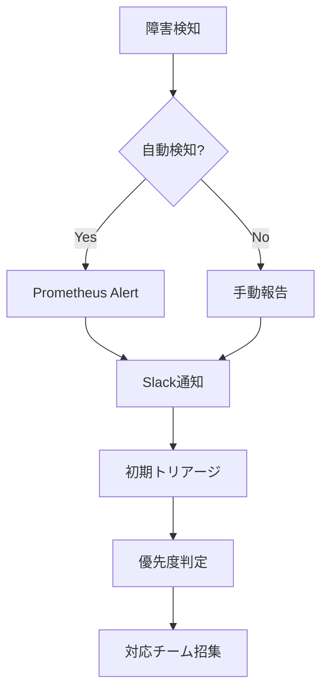

# 障害対応手順書 - ホームヘルパー管理システム

## 概要

本文書は、ホームヘルパー管理システムで発生する可能性のある障害に対する対応手順を定義します。アクセシビリティユーザーへの影響を最小限に抑えることを最優先とします。

## 障害分類・優先度

### 優先度定義

| 優先度 | 説明 | 対応時間 | 対応者 |
|--------|------|----------|--------|
| **P0 - 緊急** | システム全体停止、データ消失リスク | 15分以内 | 全チーム |
| **P1 - 高** | 主要機能停止、アクセシビリティ機能問題 | 1時間以内 | システム管理者 |
| **P2 - 中** | 一部機能停止、パフォーマンス劣化 | 4時間以内 | 運用チーム |
| **P3 - 低** | 軽微な問題、機能制限 | 24時間以内 | 開発チーム |

### アクセシビリティ関連の特別扱い
- スクリーンリーダー対応不具合 → **P1**
- 高コントラストモード問題 → **P1**
- キーボードナビゲーション問題 → **P1**
- フォントサイズ調整問題 → **P2**

## 初期対応フロー

### 1. 障害検知・報告



### 2. 初期確認項目（5分以内）

```bash
# システム全体ヘルスチェック
./scripts/health-check.sh

# サービス状態確認
docker-compose -f docker-compose.prod.yml ps

# リソース使用状況確認
docker stats --no-stream
df -h
free -h

# 最新ログ確認
docker-compose -f docker-compose.prod.yml logs --tail=50 backend
docker-compose -f docker-compose.prod.yml logs --tail=50 frontend
docker-compose -f docker-compose.prod.yml logs --tail=50 nginx
```

### 3. ユーザー影響確認

```bash
# アクティブユーザー数確認
curl -s http://localhost:9090/api/v1/query?query=websocket_connections_active

# エラー率確認
curl -s http://localhost:9090/api/v1/query?query=rate\(http_requests_total\{status=~\"5..\"\}\[5m\]\)

# アクセシビリティ機能状態確認
curl -f https://your-domain.com/accessibility/status
```

## 個別障害対応手順

### システム全体停止（P0）

#### 症状
- サイトにアクセスできない
- 全サービスが応答しない
- データベース接続不可

#### 対応手順

1. **即座実行（5分以内）**
```bash
# サーバー基本状態確認
systemctl status docker
systemctl status nginx
df -h
free -h

# 緊急時サービス再起動
docker-compose -f docker-compose.prod.yml restart

# 外部からのアクセス確認
curl -f https://your-domain.com/health
```

2. **根本原因調査（15分以内）**
```bash
# システムログ確認
journalctl -u docker --since "10 minutes ago"
journalctl -xe

# ディスク容量問題確認
du -sh /var/lib/docker/
du -sh /opt/home-helper-system/

# メモリ・CPU確認
top
iotop
```

3. **復旧手順**
```bash
# 最新バックアップから復元（必要時）
./scripts/backup.sh database

# 前回正常時の状態に戻す
git log --oneline -5
git checkout <last_working_commit>
docker-compose -f docker-compose.prod.yml up -d --build
```

### データベース障害（P0/P1）

#### 症状
- データベース接続エラー
- 500エラーの大量発生
- データ不整合

#### 対応手順

1. **PostgreSQL状態確認**
```bash
# PostgreSQL接続テスト
docker-compose -f docker-compose.prod.yml exec postgres pg_isready -U $POSTGRES_USER

# 接続数確認
docker-compose -f docker-compose.prod.yml exec postgres psql -U $POSTGRES_USER -d $POSTGRES_DB -c "SELECT count(*) FROM pg_stat_activity;"

# ロック状況確認
docker-compose -f docker-compose.prod.yml exec postgres psql -U $POSTGRES_USER -d $POSTGRES_DB -c "SELECT * FROM pg_locks WHERE NOT granted;"
```

2. **データベース復旧**
```bash
# PostgreSQLログ確認
docker-compose -f docker-compose.prod.yml logs postgres

# データベース再起動
docker-compose -f docker-compose.prod.yml restart postgres

# 整合性チェック
docker-compose -f docker-compose.prod.yml exec postgres psql -U $POSTGRES_USER -d $POSTGRES_DB -c "SELECT datname, numbackends FROM pg_stat_database;"
```

3. **データ復旧（必要時）**
```bash
# 最新バックアップから復元
docker-compose -f docker-compose.prod.yml stop backend frontend
docker-compose -f docker-compose.prod.yml exec postgres pg_restore -U $POSTGRES_USER -d $POSTGRES_DB /backups/latest_backup.sql
docker-compose -f docker-compose.prod.yml start backend frontend
```

### アクセシビリティ機能障害（P1）

#### 症状
- スクリーンリーダーで読み上げられない
- キーボードナビゲーションが効かない
- 高コントラストモードが適用されない

#### 対応手順

1. **アクセシビリティ機能確認**
```bash
# アクセシビリティエンドポイント確認
curl -f https://your-domain.com/accessibility/test

# フロントエンド設定確認
curl -f https://your-domain.com/accessibility/settings

# WCAG準拠チェック
npx @axe-core/cli https://your-domain.com --tags wcag2a,wcag2aa
```

2. **設定復旧**
```bash
# フロントエンド再起動
docker-compose -f docker-compose.prod.yml restart frontend

# アクセシビリティ設定リセット
curl -X POST https://your-domain.com/api/accessibility/reset

# キャッシュクリア
docker-compose -f docker-compose.prod.yml exec nginx nginx -s reload
```

### WebSocket接続障害（P1）

#### 症状
- リアルタイム更新が停止
- 作業進捗が同期されない
- メッセージが届かない

#### 対応手順

1. **WebSocket状態確認**
```bash
# WebSocket接続数確認
curl -s http://localhost:9090/api/v1/query?query=websocket_connections_active

# WebSocketエラー確認
docker-compose -f docker-compose.prod.yml logs backend | grep -i websocket

# Redis接続確認
docker-compose -f docker-compose.prod.yml exec redis redis-cli ping
```

2. **接続復旧**
```bash
# Redisリスタート
docker-compose -f docker-compose.prod.yml restart redis

# バックエンドWebSocketマネージャーリスタート
docker-compose -f docker-compose.prod.yml restart backend

# Nginx WebSocket設定確認
docker-compose -f docker-compose.prod.yml exec nginx nginx -t
```

### SSL証明書問題（P1/P2）

#### 症状
- HTTPS接続エラー
- 証明書期限切れ警告
- ブラウザセキュリティ警告

#### 対応手順

1. **証明書状態確認**
```bash
# 証明書期限確認
openssl x509 -in nginx/ssl/server.crt -enddate -noout

# 証明書検証
openssl verify nginx/ssl/server.crt

# ブラウザからの確認
curl -I https://your-domain.com
```

2. **証明書更新**
```bash
# 証明書再取得
./nginx/scripts/renew-ssl.sh renew

# Nginx設定リロード
docker-compose -f docker-compose.prod.yml exec nginx nginx -s reload

# 証明書配置確認
ls -la nginx/ssl/
```

### パフォーマンス劣化（P2）

#### 症状
- レスポンス時間が2秒超過
- CPU/メモリ使用率が高い
- データベースクエリが遅い

#### 対応手順

1. **パフォーマンス確認**
```bash
# レスポンス時間測定
curl -w "@curl-format.txt" -o /dev/null -s https://your-domain.com/

# リソース使用状況
docker stats --no-stream
iostat -x 1 5

# データベースパフォーマンス
docker-compose -f docker-compose.prod.yml exec postgres psql -U $POSTGRES_USER -d $POSTGRES_DB -c "SELECT query, calls, total_time, mean_time FROM pg_stat_statements ORDER BY mean_time DESC LIMIT 10;"
```

2. **最適化実行**
```bash
# データベース統計更新
docker-compose -f docker-compose.prod.yml exec postgres psql -U $POSTGRES_USER -d $POSTGRES_DB -c "ANALYZE;"

# 不要なプロセス確認・終了
docker system prune -f

# Nginx キャッシュクリア
docker-compose -f docker-compose.prod.yml exec nginx rm -rf /var/cache/nginx/*
```

## 復旧後手順

### 1. システム状態確認

```bash
# 完全ヘルスチェック実行
./scripts/health-check.sh

# アクセシビリティ機能確認
npx @axe-core/cli https://your-domain.com

# パフォーマンステスト
curl -w "@curl-format.txt" -o /dev/null -s https://your-domain.com/
```

### 2. 監視アラート確認

```bash
# Prometheusアラート状態
curl -f http://localhost:9090/api/v1/alerts

# Grafanaダッシュボード確認
curl -f http://localhost:3001/api/health
```

### 3. ユーザー通知

- 障害報告（必要時）
- 復旧通知
- 影響範囲・対処内容の説明
- アクセシビリティユーザーへの特別案内

## 事後処理

### 1. 障害報告書作成

#### 報告書テンプレート

```markdown
# 障害報告書

## 基本情報
- **発生日時**: YYYY/MM/DD HH:MM - HH:MM
- **影響時間**: XX分
- **優先度**: PX
- **対応者**: 

## 障害概要
- **症状**: 
- **影響範囲**: 
- **ユーザー影響**: 
- **アクセシビリティ影響**: 

## 根本原因

## 対応内容

## 今後の対策
- **短期**: 
- **中期**: 
- **長期**: 

## 教訓・改善点
```

### 2. 原因分析・再発防止

```bash
# ログ解析
grep "ERROR" /var/log/*.log | tail -100

# メトリクス分析
# Grafanaで障害前後のメトリクス確認

# 設定変更履歴確認
git log --since="1 day ago" --oneline
```

### 3. システム改善

- 監視アラートの調整
- 自動復旧機能の強化
- ドキュメント更新
- チーム研修実施

## 緊急連絡先

### 社内連絡先
- **システム管理者**: admin@your-domain.com / +81-XX-XXXX-XXXX
- **開発チームリード**: dev-lead@your-domain.com / +81-XX-XXXX-XXXX
- **プロダクトマネージャー**: pm@your-domain.com / +81-XX-XXXX-XXXX

### 外部連絡先
- **VPSプロバイダー**: support@provider.com / +81-XX-XXXX-XXXX
- **CDNプロバイダー**: support@cdn.com / +81-XX-XXXX-XXXX
- **監視サービス**: support@monitoring.com / +81-XX-XXXX-XXXX

### エスカレーション手順

1. **Level 1 (0-15分)**: 運用チーム対応
2. **Level 2 (15-30分)**: システム管理者エスカレーション
3. **Level 3 (30-60分)**: 開発チーム招集
4. **Level 4 (60分+)**: 経営陣報告

## チェックリスト

### 障害発生時
- [ ] 発生時刻記録
- [ ] 症状・影響範囲確認
- [ ] ヘルスチェック実行
- [ ] 初期対応実施
- [ ] チーム通知
- [ ] ユーザー通知（必要時）

### 復旧時
- [ ] システム状態確認
- [ ] アクセシビリティ確認
- [ ] パフォーマンス確認
- [ ] 監視復旧確認
- [ ] ユーザー通知
- [ ] 障害報告書作成

---

**重要**: アクセシビリティユーザーへの影響を常に最優先で考慮し、迅速な対応を心がけてください。