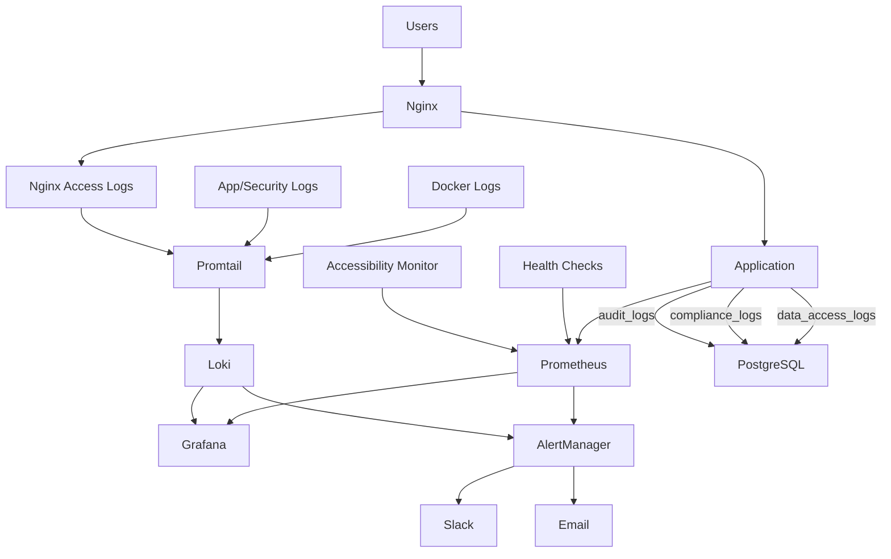

# 監視・運用手順書 - ホームヘルパー管理システム

## 概要

本文書は、ホームヘルパー管理システムの日常的な監視・運用手順を定義します。アクセシビリティ機能の監視を含む包括的な運用を目的としています。

## 監視アーキテクチャ



### Loki + Promtail ログ集約基盤

※ 詳細設定は[ログ監査・収集強化仕様書](../logging_audit_specification.md) セクション2を参照

**概要**: Loki + PromtailでDockerコンテナログ、アプリケーションログ、セキュリティログを一元収集し、Grafanaで検索・可視化する。

```bash
# Loki ヘルスチェック
curl -f http://localhost:3100/ready

# Promtailターゲット確認
curl -f http://localhost:9080/targets

# Lokiへのログ取り込み状況確認
curl -s http://localhost:3100/metrics | grep loki_ingester_chunks_stored_total

# Lokiストレージ使用量確認
du -sh /var/lib/docker/volumes/*loki*
```

**LogQLクエリ例**:
```logql
# 直近のエラーログ
{job="app"} | json | level="ERROR"

# 特定ユーザーの操作ログ
{job="app"} | json | user_id="<target_user_id>"

# 認証失敗ログ
{job="security"} | json | event="auth_attempt" | success="false"

# HTTPエラーレスポンス
{job="nginx"} | regexp `(?P<status>\d{3})` | status >= 400
```

## 日常運用タスク

### 毎日の確認事項（朝）

#### 1. システム全体状況確認

```bash
# ヘルスチェック実行
cd /opt/home-helper-system
./scripts/health-check.sh

# サービス稼働状況確認
docker-compose -f docker-compose.prod.yml ps

# ディスク使用量確認
df -h
du -sh /var/lib/docker/
```

#### 2. 夜間バックアップ確認

```bash
# バックアップ実行状況確認
ls -la /backups/ | tail -5

# バックアップログ確認
tail -20 /var/log/backup.log

# バックアップ完整性確認（週1回）
./scripts/backup.sh test
```

#### 3. パフォーマンス指標確認

```bash
# CPU・メモリ使用率確認
docker stats --no-stream

# データベース接続数確認
docker-compose -f docker-compose.prod.yml exec postgres psql -U $POSTGRES_USER -d $POSTGRES_DB -c "SELECT count(*) FROM pg_stat_activity WHERE state = 'active';"

# WebSocket接続数確認
curl -s http://localhost:9090/api/v1/query?query=websocket_connections_active
```

#### 4. アクセシビリティ機能確認

```bash
# アクセシビリティエンドポイント確認
curl -f https://your-domain.com/accessibility/status

# WCAG準拠チェック（週1回）
npx @axe-core/cli https://your-domain.com --tags wcag2a,wcag2aa

# アクセシビリティメトリクス確認
curl -s http://localhost:9090/api/v1/query?query=accessibility_features_usage
```

### 毎週の確認事項

#### 1. セキュリティ更新確認

```bash
# システムパッケージ更新確認
sudo apt list --upgradable

# Dockerイメージ更新確認
docker images | grep -E "(days|weeks|months) ago"

# SSL証明書期限確認
openssl x509 -in nginx/ssl/server.crt -enddate -noout
```

#### 2. ログ分析

```bash
# エラーログ分析
grep -i error /var/log/nginx/error.log | tail -50
docker-compose -f docker-compose.prod.yml logs backend | grep -i error | tail -50

# アクセスパターン分析
awk '{print $1}' /var/log/nginx/access.log | sort | uniq -c | sort -nr | head -20

# セキュリティログ確認
grep "403\|404\|401" /var/log/nginx/access.log | tail -50
```

#### 3. パフォーマンストレンド分析

```bash
# データベースパフォーマンス分析
docker-compose -f docker-compose.prod.yml exec postgres psql -U $POSTGRES_USER -d $POSTGRES_DB -c "
SELECT query, calls, total_time, mean_time, rows 
FROM pg_stat_statements 
ORDER BY mean_time DESC 
LIMIT 10;"

# ディスク使用量トレンド確認
du -sh /opt/home-helper-system/* | sort -hr
```

### 毎月の確認事項

#### 1. 容量計画・リソース確認

```bash
# ストレージ成長率分析
du -sh /backups/* | tail -30

# データベースサイズ確認
docker-compose -f docker-compose.prod.yml exec postgres psql -U $POSTGRES_USER -d $POSTGRES_DB -c "
SELECT 
    schemaname,
    tablename,
    pg_size_pretty(pg_total_relation_size(schemaname||'.'||tablename)) as size
FROM pg_tables 
WHERE schemaname = 'public'
ORDER BY pg_total_relation_size(schemaname||'.'||tablename) DESC;"
```

#### 2. セキュリティ監査

```bash
# 脆弱性スキャン実行
docker run --rm -v /opt/home-helper-system:/target aquasec/trivy fs /target

# アクセスログセキュリティ分析
grep -E "(admin|wp-admin|phpMyAdmin)" /var/log/nginx/access.log | tail -20

# 認証失敗ログ確認
docker-compose -f docker-compose.prod.yml logs backend | grep -i "authentication failed" | tail -20
```

## 監視ダッシュボード

### Grafanaダッシュボード設定

#### 1. システム概要ダッシュボード

**主要メトリクス**:
- システム稼働率
- レスポンス時間（95percentile）
- エラー率
- アクティブユーザー数
- WebSocket接続数

**設定例**:
```json
{
  "dashboard": {
    "title": "Home Helper System - Overview",
    "panels": [
      {
        "title": "System Uptime",
        "type": "singlestat",
        "targets": [
          {
            "expr": "up{job=\"backend\"}"
          }
        ]
      },
      {
        "title": "Response Time (95th percentile)",
        "type": "graph",
        "targets": [
          {
            "expr": "histogram_quantile(0.95, rate(http_request_duration_seconds_bucket[5m]))"
          }
        ]
      }
    ]
  }
}
```

#### 2. アクセシビリティダッシュボード

**専用メトリクス**:
- スクリーンリーダー使用率
- 高コントラストモード使用率
- フォントサイズ調整利用率
- キーボードナビゲーション使用率
- アクセシビリティエラー数

#### 3. ログ検索ダッシュボード（Loki）

**LogQLベースの検索パネル**:
- サービス別ログ検索（backend, nginx, postgres）
- ログレベル別フィルタ（ERROR, WARNING, INFO）
- trace_idによるリクエスト横断追跡
- 時系列ログボリューム表示

#### 4. 個人データアクセスダッシュボード

**データアクセス監視パネル**:
- アクセス件数推移（日別・時間帯別）
- アクセス者別統計（ロール別、ユーザー別）
- 担当外アクセス検知アラート表示
- エクスポート回数監視
- 異常パターンハイライト

#### 5. コンプライアンスダッシュボード

**法令対応状況パネル**:
- 未対応請求一覧（期限切れ警告付き）
- 同意取得状況サマリー
- データ保持期間遵守状況
- 漏えい報告タイムライン
- 月次コンプライアンスレポート

#### 6. アプリケーションダッシュボード

**機能別メトリクス**:
- レシピ作成・検索数
- 献立作成数
- 作業完了率
- メッセージ送受信数
- QRコード生成・使用数

### アラート設定

#### 1. 重要アラート（即座対応）

```yaml
# Prometheus Alert Rules
groups:
  - name: critical_alerts
    rules:
      - alert: ServiceDown
        expr: up == 0
        for: 30s
        labels:
          severity: critical
        annotations:
          summary: "Service {{ $labels.job }} is down"
          
      - alert: HighErrorRate
        expr: rate(http_requests_total{status=~"5.."}[5m]) > 0.1
        for: 2m
        labels:
          severity: critical
        annotations:
          summary: "High error rate: {{ $value }}"
          
      - alert: AccessibilityFeatureDown
        expr: accessibility_features_available == 0
        for: 1m
        labels:
          severity: critical
        annotations:
          summary: "Accessibility features unavailable"
```

#### 2. 警告アラート（1時間以内対応）

```yaml
  - name: warning_alerts
    rules:
      - alert: HighResponseTime
        expr: histogram_quantile(0.95, rate(http_request_duration_seconds_bucket[5m])) > 2
        for: 5m
        labels:
          severity: warning
        annotations:
          summary: "High response time: {{ $value }}s"
          
      - alert: HighMemoryUsage
        expr: (1 - (node_memory_MemAvailable_bytes / node_memory_MemTotal_bytes)) * 100 > 85
        for: 5m
        labels:
          severity: warning
        annotations:
          summary: "High memory usage: {{ $value }}%"
```

#### 2.5 セキュリティ監査アラート（即座〜1時間以内対応）

※ 詳細は[ログ監査・収集強化仕様書](../logging_audit_specification.md) セクション6を参照

```yaml
  - name: security_audit_alerts
    rules:
      - alert: UnassignedDataAccess
        expr: |
          count_over_time({job="app"} | json | event="personal_data_access" | has_assignment="false" [1h]) > 0
        for: 0m
        labels:
          severity: warning
        annotations:
          summary: "担当外利用者データへのアクセス検知"
          
      - alert: BulkDataAccess
        expr: |
          sum by (user_id) (count_over_time({job="app"} | json | event="personal_data_access" [1h])) > 50
        for: 0m
        labels:
          severity: critical
        annotations:
          summary: "大量個人データアクセス検知: {{ $labels.user_id }}"

      - alert: ExcessiveDataExport
        expr: |
          sum by (user_id) (count_over_time({job="app"} | json | event="data_access" | access_type="export" [24h])) >= 3
        for: 0m
        labels:
          severity: critical
        annotations:
          summary: "大量データエクスポート検知"

      - alert: LogIntegrityFailure
        expr: |
          count_over_time({job="app"} | json | event="log_integrity_failure" [1h]) > 0
        for: 0m
        labels:
          severity: critical
        annotations:
          summary: "ログ完全性検証失敗 - 改ざんの可能性"

      - alert: LokiServiceDown
        expr: up{job="loki"} == 0
        for: 1m
        labels:
          severity: critical
        annotations:
          summary: "Lokiログ収集サービスがダウン"

      - alert: PromtailServiceDown
        expr: up{job="promtail"} == 0
        for: 1m
        labels:
          severity: critical
        annotations:
          summary: "Promtailログ転送サービスがダウン"

      # --- ログパイプライン健全性監視 ---
      - alert: PromtailTargetDown
        expr: promtail_targets_active_total < 3
        for: 5m
        labels:
          severity: warning
        annotations:
          summary: "Promtail収集ターゲット減少: {{ $value }}個（期待: 5+）"

      - alert: LokiIngestionDrop
        expr: |
          rate(loki_distributor_bytes_received_total[5m]) == 0
        for: 10m
        labels:
          severity: critical
        annotations:
          summary: "Lokiへのログインジェストが10分間停止"

      - alert: LokiIngestionSpike
        expr: |
          rate(loki_distributor_bytes_received_total[5m]) > 3 * avg_over_time(rate(loki_distributor_bytes_received_total[5m])[1h:5m])
        for: 5m
        labels:
          severity: warning
        annotations:
          summary: "Lokiインジェスト率が通常の3倍を超過"

      - alert: LokiStorageHigh
        expr: |
          (node_filesystem_size_bytes{mountpoint="/loki"} - node_filesystem_avail_bytes{mountpoint="/loki"})
          / node_filesystem_size_bytes{mountpoint="/loki"} * 100 > 80
        for: 5m
        labels:
          severity: warning
        annotations:
          summary: "Lokiストレージ使用率が80%超: {{ $value }}%"

      - alert: LogGapDetected
        expr: |
          time() - max(timestamp(count_over_time({job=~"app|nginx|security"}[1m]))) > 600
        for: 5m
        labels:
          severity: warning
        annotations:
          summary: "ログ欠損の可能性: {{ $labels.job }}のログが10分以上発生なし"
```

#### 3. 情報アラート（日次確認）

```yaml
  - name: info_alerts
    rules:
      - alert: BackupNotRun
        expr: time() - backup_last_success_timestamp > 86400 * 2
        labels:
          severity: info
        annotations:
          summary: "Backup has not run for 2 days"
          
      - alert: SSLCertificateExpiringSoon
        expr: ssl_certificate_expiry_days < 30
        labels:
          severity: info
        annotations:
          summary: "SSL certificate expires in {{ $value }} days"
```

## 運用チェックリスト

### 日次チェックリスト

- [ ] システム稼働状況確認
- [ ] バックアップ実行確認
- [ ] エラーログ確認（過去24時間）
- [ ] パフォーマンス指標確認
- [ ] アクセシビリティ機能動作確認
- [ ] WebSocket接続状況確認
- [ ] ディスク使用量確認
- [ ] Loki/Promtailサービス稼働確認
- [ ] Promtailターゲット数が期待値か確認（`curl http://localhost:9080/targets`）
- [ ] Lokiインジェスト率の異常なし確認
- [ ] ログバックアップ成功通知の確認
- [ ] ログ完全性検証バッチの実行結果確認
- [ ] 未対応コンプライアンス請求の確認（期限切れチェック）

### 週次チェックリスト

- [ ] セキュリティ更新確認・適用
- [ ] SSL証明書期限確認
- [ ] ログ詳細分析
- [ ] データベースパフォーマンス分析
- [ ] バックアップ復元テスト
- [ ] WCAG準拠チェック実行
- [ ] 監視アラート設定見直し
- [ ] データアクセス異常レポートの確認（担当外アクセス、深夜帯アクセス）
- [ ] ログチェーンハッシュの整合性検証

### 月次チェックリスト

- [ ] リソース使用量トレンド分析
- [ ] 容量計画見直し
- [ ] セキュリティ監査実行
- [ ] アクセシビリティユーザー利用状況分析
- [ ] 災害復旧計画テスト
- [ ] 運用手順書更新
- [ ] チーム研修・知識共有
- [ ] コンプライアンスログ月次レビュー（同意状況、請求対応状況）
- [ ] ログストレージ容量計画（Loki、DBログテーブル）
- [ ] ログアーカイブの検証（Warm/Coldティアの整合性確認）

## 自動化スクリプト

### 1. 日次監視レポート生成

```bash
#!/bin/bash
# daily-report.sh

REPORT_DATE=$(date '+%Y-%m-%d')
REPORT_FILE="/tmp/daily-report-${REPORT_DATE}.json"

cat > "$REPORT_FILE" << EOF
{
  "date": "$REPORT_DATE",
  "system_status": {
    "uptime": "$(uptime -p)",
    "services": $(docker-compose -f docker-compose.prod.yml ps --format json),
    "disk_usage": "$(df -h / | awk 'NR==2 {print $5}')",
    "memory_usage": "$(free | awk 'NR==2{printf "%.0f%%", $3*100/$2}')"
  },
  "backup_status": {
    "last_backup": "$(ls -t /backups/ | head -1)",
    "backup_size": "$(du -sh /backups/ | cut -f1)"
  },
  "accessibility_status": {
    "features_available": $(curl -s https://your-domain.com/accessibility/status | jq '.available'),
    "wcag_compliance": "$(npx @axe-core/cli https://your-domain.com --reporter json | jq '.violations | length')"
  }
}
EOF

# Slackに送信
curl -X POST -H 'Content-type: application/json' \
  --data-binary @"$REPORT_FILE" \
  "$SLACK_WEBHOOK_URL"
```

### 2. アクセシビリティ監視スクリプト

```bash
#!/bin/bash
# accessibility-monitor.sh

# WCAG準拠チェック
VIOLATIONS=$(npx @axe-core/cli https://your-domain.com --reporter json | jq '.violations | length')

if [ "$VIOLATIONS" -gt 0 ]; then
    curl -X POST -H 'Content-type: application/json' \
      --data "{\"text\":\"⚠️ Accessibility violations detected: $VIOLATIONS issues\"}" \
      "$SLACK_WEBHOOK_URL"
fi

# アクセシビリティ機能テスト
curl -f https://your-domain.com/accessibility/test || {
    curl -X POST -H 'Content-type: application/json' \
      --data '{"text":"❌ Accessibility features test failed"}' \
      "$SLACK_WEBHOOK_URL"
}
```

### 3. パフォーマンス監視スクリプト

```bash
#!/bin/bash
# performance-monitor.sh

# レスポンス時間測定
RESPONSE_TIME=$(curl -o /dev/null -s -w '%{time_total}' https://your-domain.com/)

# しきい値チェック（2秒）
if (( $(echo "$RESPONSE_TIME > 2.0" | bc -l) )); then
    curl -X POST -H 'Content-type: application/json' \
      --data "{\"text\":\"⚠️ High response time detected: ${RESPONSE_TIME}s\"}" \
      "$SLACK_WEBHOOK_URL"
fi

# データベース接続数チェック
DB_CONNECTIONS=$(docker-compose -f docker-compose.prod.yml exec postgres psql -U $POSTGRES_USER -d $POSTGRES_DB -t -c "SELECT count(*) FROM pg_stat_activity;" | xargs)

if [ "$DB_CONNECTIONS" -gt 80 ]; then
    curl -X POST -H 'Content-type: application/json' \
      --data "{\"text\":\"⚠️ High database connections: $DB_CONNECTIONS\"}" \
      "$SLACK_WEBHOOK_URL"
fi
```

## 運用メトリクス・KPI

### システム可用性指標

| 指標 | 目標値 | 測定方法 |
|------|--------|----------|
| **稼働率** | 99.5%以上 | `up` メトリクス |
| **レスポンス時間** | 95%ile < 2秒 | `http_request_duration_seconds` |
| **エラー率** | < 0.1% | `http_requests_total{status=~"5.."}` |

### アクセシビリティ指標

| 指標 | 目標値 | 測定方法 |
|------|--------|----------|
| **WCAG準拠** | 100% | axe-core自動テスト |
| **アクセシビリティ機能利用率** | > 20% | ユーザー設定分析 |
| **スクリーンリーダー対応** | 100% | 手動テスト |

### 運用効率指標

| 指標 | 目標値 | 測定方法 |
|------|--------|----------|
| **MTTR（平均復旧時間）** | < 1時間 | 障害対応記録 |
| **MTBF（平均故障間隔）** | > 720時間 | 稼働統計 |
| **バックアップ成功率** | 100% | バックアップログ |

## トラブルシューティング

### よくある問題と対処法

#### 1. Prometheus データ収集停止

```bash
# Prometheus設定確認
docker-compose -f docker-compose.prod.yml exec prometheus promtool check config /etc/prometheus/prometheus.yml

# ターゲット状態確認
curl -f http://localhost:9090/api/v1/targets

# Prometheus再起動
docker-compose -f docker-compose.prod.yml restart prometheus
```

#### 1.5 Lokiログ収集停止

```bash
# Lokiヘルスチェック
curl -f http://localhost:3100/ready

# Promtailターゲット確認
curl -f http://localhost:9080/targets

# Lokiログ確認
docker-compose -f docker-compose.prod.yml logs --tail=50 loki

# Promtailログ確認
docker-compose -f docker-compose.prod.yml logs --tail=50 promtail

# Lokiストレージ使用量確認
du -sh /var/lib/docker/volumes/*loki*

# Loki再起動
docker-compose -f docker-compose.prod.yml restart loki promtail

# Lokiデータソース接続テスト（Grafana経由）
curl -u admin:$GRAFANA_PASSWORD http://localhost:3001/api/datasources/proxy/uid/loki/loki/api/v1/labels

# --- ログパイプライン健全性診断 ---
# Promtailアクティブターゲット数確認
curl -s http://localhost:9080/targets | jq '.[] | length'

# Lokiインジェスト率確認（bytes/sec）
curl -s http://localhost:3100/metrics | grep loki_distributor_bytes_received_total

# Lokiチャンク数確認
curl -s http://localhost:3100/metrics | grep loki_ingester_chunks_stored_total

# LokiストレージWAL使用量確認
du -sh /var/lib/docker/volumes/*loki*/_data/wal/

# 各ジョブの最新ログタイムスタンプ確認（ログ欠損検知）
for job in app nginx security postgres; do
    echo -n "$job: "
    curl -s "http://localhost:3100/loki/api/v1/query?query={job=\"$job\"}&limit=1" | jq -r '.data.result[0].values[0][0] // "NO DATA"'
done
```

#### 2. Grafanaダッシュボード表示エラー

```bash
# Grafana接続確認
curl -f http://localhost:3001/api/health

# データソース確認
curl -u admin:$GRAFANA_PASSWORD http://localhost:3001/api/datasources

# Grafana再起動
docker-compose -f docker-compose.prod.yml restart grafana
```

#### 3. アラート通知停止

```bash
# AlertManager設定確認
curl -f http://localhost:9093/api/v1/status

# Slack Webhook テスト
curl -X POST -H 'Content-type: application/json' \
  --data '{"text":"Test notification"}' \
  "$SLACK_WEBHOOK_URL"

# AlertManager再起動
docker-compose -f docker-compose.prod.yml restart alertmanager
```

## 定期メンテナンス

### 月次メンテナンス作業

```bash
# ログローテーション
sudo logrotate -f /etc/logrotate.conf

# Dockerシステムクリーンアップ
docker system prune -a -f

# データベース統計更新
docker-compose -f docker-compose.prod.yml exec postgres psql -U $POSTGRES_USER -d $POSTGRES_DB -c "VACUUM ANALYZE;"

# SSL証明書更新チェック
./nginx/scripts/renew-ssl.sh check
```

### 四半期メンテナンス作業

```bash
# システム全体更新
sudo apt update && sudo apt upgrade -y

# Docker・Docker Compose更新
# 最新版確認後、計画的に更新

# セキュリティ監査実行
docker run --rm -v /opt/home-helper-system:/target aquasec/trivy fs /target

# 災害復旧テスト実行
./scripts/backup.sh test
```

---

**注意**: 監視・運用作業は、アクセシビリティユーザーへの影響を常に考慮し、ユーザビリティを損なわないよう注意深く実施してください。